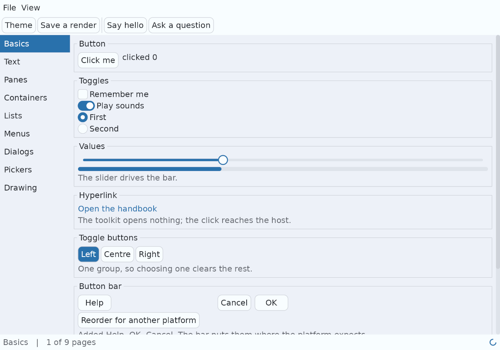

# Schultz

Schultz is a user interface toolkit written in C. You describe a screen as a
tree of nodes, and the toolkit lays it out, draws it, and routes input to it.

It is built for touch screens first and desktops second, and it is meant to be
called from more than one language: the whole interface is C functions taking
opaque handles, which is the shape every foreign function interface handles
well.

Everything on that screen is Schultz drawing itself. It is the demo that ships
with the toolkit, and you can run it in a minute; see
[Getting started](getting-started.md).

## What makes it different

**It is retained, not immediate.** You build the tree once and change the parts
that change. The toolkit remembers the rest. It repaints only the region that
actually changed, so a still screen costs almost nothing.

**It draws everything itself.** There is no native control anywhere. A button
on a phone and a button on a desktop are the same code drawing the same
shapes, so they cannot drift apart.

**A screen reader can read it.** Every widget carries a role, a name, a value
and a set of actions, and that description is published to the platform's own
accessibility API. What an assistive technology asks for comes back through
the same path real input takes, so the two cannot drift apart.

**It measures its own text.** Shaping, wrapping and line breaking are inside
the toolkit, using HarfBuzz, FreeType, libunibreak and SheenBidi. That matters
more than it sounds: asking the host how wide a string is, is the one call
most toolkits cannot avoid, and it is the one that makes a language binding
slow.

**Nothing is a pointer across the boundary.** A node is a 64 bit handle. Use
one after the node is gone and you get an error code, not a crash.

## The guides

| Guide | What it covers |
|---|---|
| [Building](building.md) | Every target: Linux, macOS, Windows, Android and iOS, and how the vendored sources are arranged |
| [Getting started](getting-started.md) | Running the demo, and a first application that compiles |
| [Concepts](concepts.md) | The tree, panes, the window, events, and how a repaint is decided |
| [Widgets and containers](widgets.md) | Every widget that ships, with a picture of each, and the three that are not widgets so much as subjects of their own: drawing, pictures, and video |
| [Styling](styling.md) | Tokens, properties, states, and the two themes |
| [Audio](audio.md) | Playing sound, recording it, and reading text aloud |
| [Accessibility](accessibility.md) | How the tree is read by a screen reader, and what makes a widget readable |
| [Repainting](repainting.md) | What gets redrawn each frame, why it is several areas rather than one, and what to check when a pixel goes stale |

The API reference is generated from the comments in the headers and is
committed beside these guides: open [api/index.html](api/index.html).
`make docs` regenerates it.

Every C snippet on these pages is put through the compiler by
`sh scripts/check_doc_code.sh`, so a call that has been renamed breaks the
documentation the same day it breaks the code.

## Where things live

| Path | What it is |
|---|---|
| `schultz_api.h` | The only header an application includes |
| `schultz_*.c`, `schultz_*.h` | The toolkit |
| `schultz_demo.c` | The demo shown above |
| `tests/` | The test suite, run with `make test` |
| `third_party/src/` | The upstream source archives, committed |
| `third_party/libunibreak/` | One dependency vendored as source, with its licence |
| `scripts/build_deps.sh` | Builds those sources for one target |
| `assets/fonts/` | DejaVu, which the demo draws with |

## Status

Schultz is under active development. The C interface is settled enough to bind
to: `schultz_api.h` is the whole of it, and every header it includes says so.
Language bindings, mobile packaging and a printing path are not written yet.

## License

Schultz is licensed under the GNU General Public License version 3 only; the
full text is in [LICENSE](../LICENSE). Commercial licensing options are
available, so reach out to Austin Lehman. Third party components keep their
own licences: see [THIRD_PARTY_NOTICES.md](../THIRD_PARTY_NOTICES.md).
