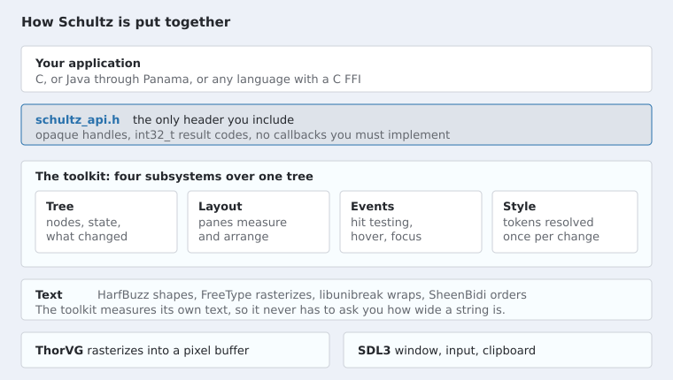
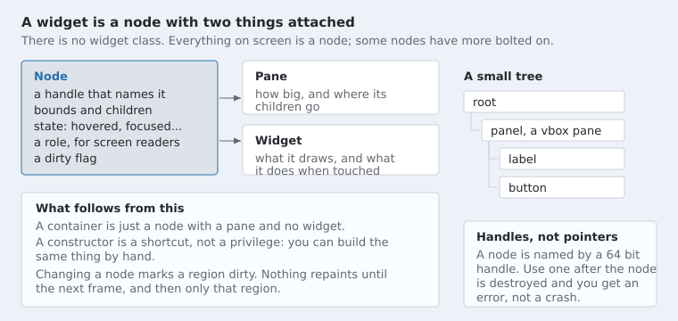
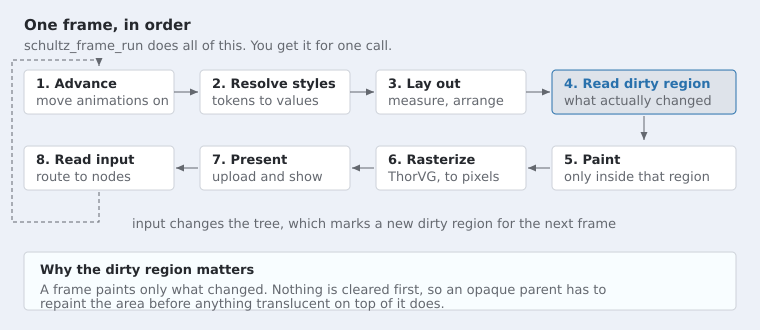

# Concepts

Four ideas carry the whole toolkit: the tree, panes, the window, and events. If
you understand those, nothing else in Schultz is surprising.

## How the pieces fit



You call `schultz_api.h`. It includes thirteen headers, and every one of them
says at the top that it is part of the host facing interface. Anything else in
the source directory is how the toolkit is built rather than what it offers.

## The tree

Everything on screen is a node. A node has a handle, bounds, children, some
state flags, an accessibility role, and a dirty flag. That is all.



A node becomes something you can see when two things are attached to it:

- a **pane**, which says how big it wants to be and where its children go
- a **widget**, which says what it draws and what it does when touched

A container is a node with a pane and no widget. A label is a node with a
widget and a pane that only measures. A button is a node with both, and a label
inside it.

This is why the constructors are a convenience rather than a privilege.
`schultz_button_create` makes a node, gives it a pane and a widget, allocates
its state, and fills in its accessibility role. You could do the same by hand.

### Text works before you say anything about fonts

Schultz has five DejaVu faces built into it. Three of them fill the theme's
font slots: body, title and mono. They are loaded when the font system is
created, and a theme falls back to them for any slot nothing was put in. So
the first program you write draws text, rather than coming up blank because no
face was ever registered.

The other two are the oblique Sans faces. They fill no slot and a style never
chooses them. They are there so the Sans family is complete, because asking a
family for its italic member only has an answer when that member is loaded.
That is what `schultz_font_at_style` does, and what lets a Bold or an Italic
button work without the program loading anything.

A sixth face carries emoji, which no text face does. It is not a slot a style
chooses. It is the face text falls back to for a character the chosen face has
no glyph for, so a label or a field holding an emoji draws it in colour with
nothing said. Shaping splits the line where coverage changes and each part is
drawn by the face that has it. `schultz_font_set_emoji` replaces the face
for a host that wants its own artwork.

Loading your own is still how you get your own look, and it overrides the
built-in for whichever slots you fill:

```c
schultz_handle face = SCHULTZ_HANDLE_NONE;
schultz_theme theme;

schultz_theme_init(&theme);
schultz_font_load_file(fonts, "assets/fonts/Inter.ttf", 16.0f, &face);
schultz_theme_set_font(&theme, SCHULTZ_TOKEN_FONT_BODY, face);
schultz_tree_set_theme(tree, &theme);
```

That fills the body slot and leaves title and mono on the built-in faces.

A face does not have to be a file. `schultz_font_load_memory` takes bytes,
which is what an Android asset, a resource bundle or a download hands you. The
bytes are copied, so the buffer is yours again as soon as it returns.

### Out of the tree, but still alive

A node normally hangs off another node, and the chain ends at the root.
Passing `SCHULTZ_HANDLE_NONE` as the parent breaks that chain on purpose:

```c
schultz_handle widget = SCHULTZ_HANDLE_NONE;
schultz_handle shelf  = schultz_tree_root(tree);

schultz_button_create(tree, shelf, "Optional", &widget);
schultz_node_set_parent(tree, widget, SCHULTZ_HANDLE_NONE);   /* take it out */
schultz_node_is_attached(tree, widget);                       /* now 0 */
schultz_node_set_parent(tree, widget, shelf);                 /* put it back */
```

A detached node keeps everything it has, including its children, its styles
and whatever its widget is holding on to, such as a scroll offset, a text
selection or where an animation had got to. What it stops doing is being part
of the screen: it is not laid out, not painted, not hit tested, not read by a
screen reader, and not ticked, and changing it marks nothing for repainting.
Giving it a parent again puts all of that back, laid out and repainted where
it lands.

That is the difference between removing a widget and destroying one.
`schultz_node_destroy` ends a node and every handle to it; detaching only
takes it off the screen. Ask `schultz_node_is_attached` which one has
happened. A node can also be born this way, with
`schultz_node_create(tree, SCHULTZ_HANDLE_NONE, &node)`, so a widget can be
built before it has anywhere to go.

Two things do not survive being taken out, because they name what is on
screen rather than the node itself: owning the text selection, and standing
in the overlay list. Ask for those again after putting the node back.

### Handles

A node is named by a 64 bit handle, never by a pointer. The handle carries an
index and a generation count, so a handle to a destroyed node does not match
anything and every call using it returns `SCHULTZ_ERR_INVALID_HANDLE`.

That costs a table lookup on every call. What it buys is that a stale
reference from a language binding is an error code instead of a crash in
someone else's address space.

### Setting a tree up by hand

A window builds a tree and gives it everything it needs, which is why none of
this appears in the examples. A host that wants a tree without one of our
windows -- to render offscreen, to drive its own loop, or because it is a
language binding with its own idea of a window -- supplies the same four
things itself:

```c
schultz_tree_set_font_system(tree, fonts);
schultz_tree_set_glyph_cache(tree, glyphs);
schultz_tree_set_image_table(tree, images);
schultz_tree_set_resources(tree, resources);
```

Each has a getter of the same name without `set_`, which is how a widget
finds them. `schultz_tree_set_audio` is the fifth, and unlike the others it
may be set at any time: a video node built before the sound system exists
picks it up when it starts.

Then the tree is moved on once a turn, which is what advances animations and
the clock a video is played against:

```c
schultz_tree_advance(tree, milliseconds);
```

The number is a clock that only rises. `schultz_window_update` calls this for
you, so a host using a window never does.

## Panes: how layout happens

A pane answers two questions:

```
measure(node, available width, available height) -> the size it wants
arrange(node, rectangle)                         -> place the children
```

Measuring happens first, from the leaves up: a label asks the font system how
wide its text is, a column adds its children's heights. Then arranging happens
from the root down, handing each node the rectangle it actually got.

Seven panes ship. They are described with pictures in
[Widgets and containers](widgets.md#containers).

One thing to know now: **height often depends on width**. A paragraph asked how
tall it is has to be told how wide it will be, or it reports one long line and
then wraps into five. Schultz handles this by measuring against a width that is
already decided, so if you set a preferred width on a node, that is the width
its height is worked out from.

### You can set the same value every turn

Laying out is the expensive half of a turn, and a setter that changes the size
or shape of something has to ask for it to run again. That would make one very
ordinary way of writing a frame loop -- push all of your current state at the
tree each turn and let it work out the difference -- the most expensive thing
your program does.

So it does not. Every setter compares first, and asks for a layout only when
what it was given differs from what it is already holding:

```c
schultz_handle clock = SCHULTZ_HANDLE_NONE;
const char *now = "00:00";

/* Once a turn, sixty turns a second, and free on the fifty nine of them
 * where the clock has not ticked. */
schultz_label_set_text(tree, clock, now);
```

Measured on a window of two hundred labels, over six hundred turns: setting a
clock that has not moved lays out nothing at all and costs 0.3 milliseconds in
total, where the same six hundred turns with text that really does change lay
out six hundred panes and cost 26 milliseconds. The saving grows with the tree,
and the point is that it is not your problem to manage.

This is worth knowing because the alternative is hosts keeping their own "has
it changed" flags beside every widget, which is the same comparison written
again in every program and gets it wrong eventually. Set the value. If it is
the value that is already there, nothing happens.

### Saying how big something is

Three calls, one for each kind of answer:

```c
schultz_node_set_pref_size(tree, node, 200.0f, SCHULTZ_SIZE_UNSET);
schultz_node_set_min_size(tree, node, 100.0f, SCHULTZ_SIZE_UNSET);
schultz_node_set_max_size(tree, node, 300.0f, SCHULTZ_SIZE_UNSET);
```

Each sets only what it names, so none can quietly undo another, and
`SCHULTZ_SIZE_UNSET` on an axis means you have no opinion about it: compute
the preferred size, impose no minimum, impose no maximum. Zero is a real size
everywhere and never means "work it out" — a node told it is zero high is
zero high.

**Preferred is a wish; minimum and maximum are rules.** A preferred size says
what to be when nothing else decides, and a pane is entitled to decide
otherwise: a box pane stretches its children across the cross axis by
default, which is why a row of buttons comes out the same height. So a
preferred width in a column is usually overridden. For a width that holds
whatever the column thinks:

```c
schultz_node_set_min_size(tree, node, 200.0f, SCHULTZ_SIZE_UNSET);
schultz_node_set_max_size(tree, node, 200.0f, SCHULTZ_SIZE_UNSET);
```

A maximum on its own caps a stretched child without pinning it; a minimum on
its own stops one being squeezed.

## The window



`schultz_window_update` does all eight steps. `schultz_window_run` repeats them
until the window closes. You can drive the steps yourself, and the toolkit's
own tests do, but there is rarely a reason to.

A window can be resized by default. Dragging its edge rebuilds the pixel
buffer, lays the tree out again for the space it now has, and posts a
`SCHULTZ_EVENT_WINDOW_RESIZED` so the application can react. Turn it off for
a window that has to stay the size it opened at, such as a kiosk:

```c
schultz_window_options options;

schultz_window_options_init(&options);
options.resizable = 0;
```

Asking for `maximized` turns resizing back on whatever this said, because a
window manager will not maximize a window that has declared it cannot be
resized. A phone ignores both: the window is the screen there.

### Pixels, and screens that have more of them

Every size in Schultz is a number of pixels. A border two wide is two pixels,
a control forty four tall is forty four pixels, and the window is as many
across as `schultz_window_width` says.

A phone complicates that, because it packs three of its pixels into the space
an ordinary monitor gives one. Two pixels of border on such a screen is a
line you can barely see. So by default the toolkit draws everything larger
there, by exactly that factor: on a three times screen a two unit border is
six pixels and looks the same weight as two pixels on a desktop.

Everything moves together. Theme tokens, the sizes built into the widgets and
a number written by hand all scale by the same amount, so a hand tuned
`padding` and the control beside it never disagree. Text is not stretched
either: glyphs are rasterized at the size they will actually be drawn, so a
sixteen unit font on a three times screen is rasterized at forty eight pixels
and is as sharp as anything native.

A screen with nothing to scale is unaffected, and that is most of them.

#### Turning it off

```c
schultz_window_options options;

schultz_window_options_init(&options);
options.scale_to_screen = 0;
```

Now one unit is one pixel of the screen in front of the user, everywhere and
always. A two wide border is two pixels of a phone's screen. That is the
setting for work that has to land on exact pixels, and it hands you the
arithmetic: the built in theme is written for an ordinary monitor, so a phone
gets a forty four pixel control, about two millimetres tall. Ask for the
scale and multiply, or build a theme with the numbers you want.

```c
scale = schultz_window_pixel_scale(window);   /* 3.0 on a dense phone */
```

That call is also how you name a real pixel while everything else stays
scaled: a line `1.0f / scale` wide is one pixel exactly.

#### A canvas can opt out on its own

A drawing is the usual reason to want real pixels, and it would be a shame to
give up scaling everywhere else to get them. So a canvas can switch by
itself:

```c
schultz_canvas_set_pixel_exact(tree, canvas, 1);
schultz_canvas_pixel_size(tree, canvas, &width, &height);
```

Inside that canvas one unit is one pixel of the screen. The canvas is still
placed and sized like any other widget, so one a hundred units wide still
takes a hundred units of the layout; its drawing space is three hundred wide
on a three times screen, and `schultz_canvas_pixel_size` is that number.
Asking rather than multiplying is the point: it is the step that is easy to
get wrong.

To see any of this on a machine with nothing to scale, set
`SCHULTZ_PIXEL_SCALE=3`. It takes the same path a phone does, and
`scripts/check_pixel_scale.sh` uses it.

#### When a screen looks wrong

Set `SCHULTZ_TRACE_GEOMETRY=1` and the window prints everything it decided:

```
schultz: buffer 1206x2622  screen scale 3.00  scaling on
schultz: a unit is 3.00 pixels, so the window is 402x874
schultz: safe area 0,47 402x815
schultz: build against 402x815
```

It prints once at startup and again whenever the window changes. **Two lines
that disagree on a window nobody resized means the size at startup was
wrong**, and a host that built its tree from the first one is holding the
wrong numbers.

If the last line is not what a host is building against, the difference is on
the host's side; if the buffer is not the screen's own resolution, the
platform did not give one. Reading four numbers
beats measuring a photograph, which on a phone is otherwise the only
evidence there is.

`SCHULTZ_DUMP_BUFFER=/tmp/frame.ppm` writes the pixel buffer itself, once.
That is the last word on what was drawn: asking the window system for a
picture of a window answers with the border around it and whatever the desktop
had behind it, which can make a fully painted window look two thirds empty.
`scripts/check_full_paint.sh` reads it, and asserts that nothing is ever left
unpainted at any scale.

### The safe area

A phone puts a camera notch over the top of its screen and a home indicator
across the bottom, and a rounded corner cuts the edges. A window that fills
the screen covers all of it, including the parts something is sitting over.

Schultz splits those two things apart:

- **The root node is given the safe area as its bounds.** A host builds its
  shell as a child of the root, so the shell and everything under it land
  inside the safe area without asking for anything.
- **The whole window is still painted.** Before the tree draws, the window
  fills the window with the root's background colour, which is the theme's
  window colour unless a host changes it. The notch and the indicator then
  border the same background as the rest of the screen instead of a black
  bar.

**An overlay is placed in the safe area too.** A menu, a popover, a tooltip
and a toast are all positioned against the screen rather than by a pane, and
they use the safe area for it, so a menu never opens under the notch and a
toast never lands beneath the home indicator. `schultz_tree_safe_area` is the
same rectangle if you place something yourself.

The one thing that deliberately uses the whole window is a dialog's scrim,
which declares `schultz_node_set_fills_viewport`. A scrim that stopped at the
safe area would leave a strip of the application showing above a modal
dialog.

`schultz_window_width` and `schultz_window_height` report the safe size, because
what a host wants from them is the area it may fill. A tree built the ordinary
way, sized against those, is correct on a phone and unchanged on a desktop,
where the safe area is the whole window.

The window asks the platform when it opens, when it resizes, and when
the platform says it changed, which is what happens when a phone is turned or
a keyboard comes up.

For a host that positions something itself:

```c
schultz_rect safe;

schultz_window_safe_area(window, &safe);
```

That is the safe rectangle within the window, in the same units
`schultz_window_width` counts. Note that node bounds are relative to the
parent, and the root is already at the safe origin, so a child of the root
starts at `(0, 0)` rather than at `safe.x, safe.y`.

**The root's bounds belong to the window.** They are set when the window opens
and again every time the safe area changes, and that is where the offset lives.
A host that sets them itself overwrites it. If a host has a reason to keep the
root sized, it has to write the whole rectangle:

```c
schultz_rect safe;

schultz_window_safe_area(window, &safe);
schultz_node_set_bounds(tree, schultz_tree_root(tree), safe);
```

Building the rectangle out of `schultz_window_width` and
`schultz_window_height` and an origin of `(0, 0)` looks right and is not: those
two report the safe *size*, so the tree comes out the correct size in the wrong
place, hard against the top left of the screen with the notch over it. It looks
correct until the screen is turned, because the safe area's size does not
change until then and a host that writes only on a change never writes at all.

The platform reports its safe area in its own coordinates, and the toolkit
converts it to whatever a unit currently is. A host never sees the unconverted
numbers.

To see any of this on a machine that has no notch, set
`SCHULTZ_SAFE_INSET="top,bottom,left,right"` in pixels. It takes the same path
the real one does, and `scripts/check_safe_area.sh` uses it.

#### Overlays are not part of the flow

A dialog, a menu and a popover are children of the root, so that they can
paint over everything and take input before anything else does. They are not
laid out with everything else, though: a pane skips them, and each is placed
by its own rule.

- A dialog covers the window. It declares `schultz_node_set_fills_viewport`,
  and layout gives it the viewport every pass.
- A menu or a popover sits beside whatever opened it. It declares
  `schultz_node_set_anchored` with that anchor, and layout places it against
  the anchor every pass, nudging it back inside the window if it would hang
  off an edge.

Both are declarations rather than one time placements, so an overlay follows
the window when it changes size. That matters more than it sounds: on a phone
a rotation is a resize, and it dismisses nothing.

This is also why a pane on the root is now harmless. It used to arrange a
dialog into the column along with everything else, which left it covering
part of the window and answering nothing, and the only protection was a rule
nobody had written down.

#### A node that places itself

A toast is not an overlay. It never takes input, and toasts come and go as
their timers run out rather than in the stack order the overlay list keeps.
It is still placed by its own rule, though: it sits against an edge of the
window and stacks with the other toasts. So it says so:

```c
schultz_handle floating = SCHULTZ_HANDLE_NONE;

schultz_panel_create(tree, schultz_tree_root(tree), &floating);
schultz_node_set_places_itself(tree, floating, 1);
schultz_node_set_bounds(tree, floating, schultz_rect_make(310, 250, 80, 40));
```

Use it for any node your own code positions. Without it such a node only
stays put while no pane sits above it, which is not a rule anything enforces
or that you could guess: give your root a column later and your hand placed
nodes are quietly swept into it.

What you take on with it is the other half of what an overlay gets for free.
A pane will not move the node, and it will not move it back either, so
following the window when it changes size is now your job. A toast does that
from its own clock.

#### Stopping

`schultz_window_run` runs until the window is closed. A machine showing one
application on a bare screen has no window furniture to close it with, so an
application needs its own way out:

```c
schultz_window_request_close(window);
```

The loop ends after the turn that calls it. **No key is bound to this by the
toolkit.** Escape in particular is not: it closes a dialog and cancels a menu,
and an application that ended on it would vanish the first time somebody
backed out of something.

### What gets repainted is the point

Step four is what makes the toolkit cheap. Changing a node marks a rectangle
dirty rather than repainting anything. When the next turn comes, the toolkit
paints only what was marked.

A few rectangles, not one. One would mean two small changes at opposite
corners repainting everything between them, which on a real page was measured
at seventy times more work than the change needed. See
[Repainting](repainting.md) for how the areas are chosen and what to do when a
pixel goes stale.

A still screen costs the cost of finding out that nothing changed. Moving the
mouse across a button repaints the button, not the window. Run the demo with
`--debug-dirty` and you can watch it.

Two consequences worth carrying with you:

**Nothing is cleared first.** A partial frame paints over what was already
there. That works because an opaque parent repaints the region before its
children do. If you make a whole chain of ancestors transparent and put
something translucent on top, it will composite onto its own previous output
and darken frame by frame.

**Anything drawn outside a node's bounds has to be declared.** A focus ring is
drawn a few units outside the control it belongs to. If the toolkit invalidated
only the bounds, the ring would be painted once and never repainted. That is
what `schultz_node_set_paint_margin` is for, and every widget that draws
outside itself sets it.

## The clipboard

Cut, copy and paste work inside a text field with nothing from you: the
window installs the platform's clipboard when it opens, on every target. This
section is for the rest of it, which is putting your own data there and
taking it back.

### Putting something on it

Text is one call:

```c
schultz_tree_clipboard_write(tree, "some words");
```

A selection is one call too, and it carries more than words. The options are
what a render needs, so that a picture in the selection can be drawn; pass
NULL to offer the text alone.

```c
schultz_selection_area_copy(tree, area, &render_options);
```

That offers the selection three ways at once: as HTML with the bold, italic
and colour intact, as plain text, and, when the selection is a picture and
nothing else, as `image/png`. The program pasting picks whichever it
understands, so a word processor gets the formatting and a text box gets the
words, and neither had to be asked which it wanted.

Anything else, you produce and hand over:

```c
schultz_clipboard_entry entry;

entry.format = "image/png";
entry.bytes  = png_bytes;
entry.length = png_length;
schultz_tree_clipboard_write_bytes(tree, &entry, 1u);
```

Pass several entries to offer several formats. They go up together, most
preferred first, and the bytes are copied, so yours may be freed straight
away. Copying a picture of a widget is this plus `schultz_render_encode`; see
[Widgets](widgets.md).

**Each of these replaces what was there.** Calling one twice does not offer
two formats, it offers the second, because that is what putting something on
a clipboard means.

**Not every platform carries every format.** Windows takes markup, plain text
and `image/png`, and ignores anything else; the others take what they are
given. Offering only formats the platform cannot carry is refused with
`SCHULTZ_ERR_UNAVAILABLE` rather than quietly emptying the clipboard.

### Taking something off it

```c
const char *pasted = schultz_tree_clipboard_read(tree);
```

`NULL` when the clipboard holds no text. What comes back is owned by the
toolkit and stays valid until the next clipboard call, so copy it if you want
to keep it.

Paste asks for plain text and nothing else, which is worth knowing in one
direction: Schultz writes HTML and does not read it, so formatting copied out
of Schultz survives into a word processor, and formatting copied out of a word
processor arrives here as plain words.

### A clipboard of your own

`schultz_tree_set_clipboard` replaces the platform's with three functions of
yours. Almost nothing needs it — the window installs one already — and it
exists for a host driving a tree without one of our windows.

## Files the person chooses

A file dialog is the platform's own, not a Schultz window, and it does not
answer straight away. The call returns a request number and the answer arrives
later as an event carrying that number, the same way everything else does.

```c
schultz_file_filter kinds[2];
schultz_file_options how = {0};      /* zero first, then set what matters */
uint32_t request = 0u;

kinds[0].name = "Pictures";   kinds[0].pattern = "png;jpg;webp";
kinds[1].name = "Every file"; kinds[1].pattern = "*";

how.title        = "Choose a picture";
how.filters      = kinds;
how.filter_count = 2u;
how.allow_many   = 1;

schultz_window_open_file(window, &how, &request);
```

`schultz_window_save_file` and `schultz_window_open_folder` take the same
options. The options are copied, so they may be locals.

Then, when the event arrives:

```c
if (event->type == SCHULTZ_EVENT_FILES_CHOSEN) {
    uint32_t count = schultz_window_file_count(window, event->token);
    uint32_t i;

    for (i = 0; i < count; i++) {
        const char *path = schultz_window_file_path(window, event->token, i);
        (void)path;
    }
}
```

`SCHULTZ_EVENT_FILES_CANCELLED` is the other answer. `schultz_window_file_filter`
says which filter was showing when the choice was made, or -1 where the
platform did not say.

**Keep drawing while it is open.** On Linux the dialog runs through XDG
portals over D-Bus, which needs the loop turning. A host that blocks waiting
for the answer waits forever.

**On iOS the path is a copy.** iOS does not let an application open a file the
person chose; it hands back something outside the sandbox that an ordinary
open would refuse. So the file is copied into the application's own temporary
directory and that copy is what comes back. Reading it works the way it does
everywhere else, but writing to it changes the copy rather than the original,
and the system may empty that directory, so read what you need rather than
keeping the path for later. Saving on iOS asks a different question as well:
the platform can only export a file that already exists, so the person chooses
where to put a file that is already named rather than typing a name.

## Events

Input arrives from the platform and is turned into events aimed at one node.
Hit testing finds the deepest node under the pointer.

That last sentence causes a problem worth knowing about: a button is a node
with a label inside it, so the deepest node under the pointer is the caption,
not the button. Schultz solves it with a flag. `schultz_node_set_hit_testable` makes a node
invisible to the pointer while its children stay reachable, which is
`pointer-events: none` in CSS. Every composed control turns it off on its
decoration.

### Getting told

There are two ways to hear about an event, and they carry exactly the same
events.

**A callback.** Install one with `schultz_events_set_callback`. Simple, and
right for an application written in C.

**A queue.** Turn on `schultz_events_set_queue` and call
`schultz_events_drain` once a turn. Nothing calls you at all. This is what a
language binding wants: crossing a foreign function boundary is expensive in
the toolkit-calls-you direction, and this replaces one crossing per click with
one per turn.

### Tokens

You rarely want to compare node handles in an event handler. Stamp a node with
`schultz_node_set_token` and every event about it carries that number back in
`event->token`.

### Disabled

A node carries `SCHULTZ_STATE_ENABLED`, and turning it off is inherited:
everything inside a disabled node is disabled too, so switching a panel off
switches off every control on it.

A disabled node still stops the pointer. It does not let a press through to
whatever is behind it, which is what a greyed button on a panel must do. What
it does not do is anything else: no hover, no press, no click, no scroll, and
no keys. Focus is given up if it was already held, tab skips it, and an
assistive technology is refused when it asks to press it, so what the
accessibility layer reports and what the toolkit permits agree.

A widget therefore does not need to check the flag itself. Nothing reaches it.

Two paths do not go through the router, because the panel they come from
hangs off the root rather than off the widget that owns it: the rows of a
combo box's menu, and the contents of the panel a picker opens. Both refuse
to carry anything to an owner that has been switched off, so the rule holds
there too.

### Focus and the keyboard

A node is focusable when it is visible, enabled, and declares the focus action
in its accessibility schema. There is no second notion of focusability to keep
in step. Tab order is tree order.

Not everything that answers the keyboard takes focus. A block of selectable
prose is the example: it can be selected and copied, but making every paragraph
a tab stop would ruin a form. The tree tracks which node holds the text
selection, and copy is routed there.

A press decides where focus is. On a focusable node it moves there; on
anything else, empty space or a label or a plain container, focus goes away.

**When a press decides depends on the pointer.** A cursor decides on the way
down, which is what a desktop does and what dragging from a field to select
text needs: the caret has to land before a drag can extend anything. A finger
decides when it lifts, and only if it stayed still. A finger that lands in a
text field and moves is scrolling the page, and focusing the field would put a
keyboard over the thing the person was trying to read. That is what a browser
does and what Android does; iOS is the odd one out, and applications there
generally turn its behaviour off.

A widget has the other half of this to honour: on a finger it should neither
act nor consume the press, because an event that is taken never reaches the
view that would have scrolled. The text field and the selectable label both
wait for the tap, and so do the keys of the on-screen keyboard.
That last half is what closes a phone's on-screen keyboard: the keyboard
follows focus and is managed nowhere else, so a field that kept focus kept the
keyboard, and tapping the background is how a person says they are done.
Pressing with the secondary button is the exception, since it asks for a
context menu rather than pressing what is under it.

One other thing may opt out: `schultz_node_set_keeps_focus` says that pressing
this node leaves focus exactly where it is. It is for a control that acts on
whatever is being edited, and it stops both halves of the rule above. A key on
the on-screen keyboard cannot hold focus, so without it a press would clear
focus before the key was even told, the letter would arrive nowhere, and the
keyboard, which follows focus, would take itself away. A toolbar's Bold button
over a text area is the other half: it is focusable, so it is reachable by tab
like any control, and pressing it must still leave the caret in the text it is
about to embolden. The flag is asked before anything else about a press, so it
answers both.

One consequence worth knowing on a touch screen: starting a drag to scroll is
a press on the content, so it takes focus away and the keyboard closes. That
matches most phone applications, and it is the same rule rather than a special
case.

#### Where a keystroke comes from

A field cannot tell one source of typing from another, and that is on purpose.
Everything that types goes through the same two calls: `schultz_events_key`
for a key that has a code, and `schultz_events_text_input` for text that has
been committed. The platform layer makes those calls for a real keyboard, an
input method makes them for a composed character, and the keyboard Schultz
draws for a machine with no keys makes exactly the same two.

That is why the on-screen keyboard needed no widget to change to accept it,
and why a keypad of your own is only a row of buttons that make those calls.
It is also why the keyboard's own keys do not take focus: the field being
edited has to keep it, or the first press would end the edit. See
[the on-screen keyboard](widgets.md#the-on-screen-keyboard).

## Styling, in one paragraph

Every visual property resolves through five layers, from the theme at the
bottom to a state patch at the top. Styles reference **tokens** rather than
literal values, so changing the theme changes everything that pointed at it.
[Styling](styling.md) covers it properly.

## Accessibility is not a separate pass

A node carries a role, a name, a value and a set of actions, and the
constructors fill them in. The same schema is what focus order is computed
from, so a control that is reachable by keyboard is one a screen reader can
describe, by construction rather than by remembering.
