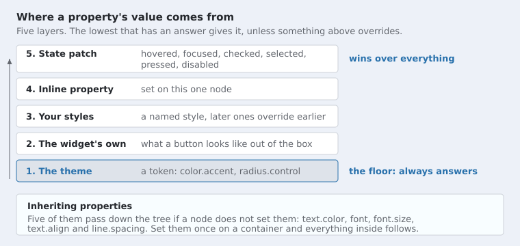

# Styling

Schultz draws everything itself, so everything about how it looks is yours to
change. This page is the complete list of what you can set.

## The idea

A style property is either a **literal value** or a **token reference**.

```c
/* A literal: this node is this colour, whatever the theme says. */
schultz_node_set_style_property(tree, node, SCHULTZ_PROP_BACKGROUND,
    schultz_value_color(schultz_color_rgba(0x29, 0x71, 0xac, 0xff)));

/* A token: this node is whatever the theme calls the accent colour. */
schultz_node_set_style_property(tree, node, SCHULTZ_PROP_BACKGROUND,
    schultz_value_token(SCHULTZ_TOKEN_COLOR_ACCENT));
```

The second one follows the theme. Switch from light to dark and it changes;
the literal does not. Prefer tokens, and reach for a literal when you mean a
specific colour and not a role.

## Where a value comes from



Styles are resolved once when something changes, not once per draw. A node
that nothing has touched costs nothing to resolve.

To set one property on one node, use `schultz_node_set_style_property`. To
share a look between many nodes, build a patch and register it as a style with
`schultz_style_register`, then add it to nodes with `schultz_node_add_style`.

## Names in this page, and names in C

The tables below use the short names the toolkit uses internally:
`corner.radius`, `color.accent`, `space.md`. The C identifier is the same name
in capitals, with dots as underscores and a prefix saying what kind of thing it
is:

| In this page | In C |
|---|---|
| the `corner.radius` property | `SCHULTZ_PROP_CORNER_RADIUS` |
| the `color.accent` token | `SCHULTZ_TOKEN_COLOR_ACCENT` |
| the `space.md` token | `SCHULTZ_TOKEN_SPACE_MD` |
| the `hovered` state | `SCHULTZ_STYLE_STATE_HOVERED` |

## Properties

Twenty three properties exist. "Layout" means changing it re-runs layout;
"inherits" means a node with no value of its own takes its parent's.

### Paint

| Property | Type | Inherits | What it does |
|---|---|---|---|
| `background` | colour | no | Fill behind the node |
| `border.color` | colour | no | Outline colour |
| `border.width` | number | **layout** | Outline width, which insets the content |
| `border.dash` | dash | no | Dash pattern for the outline |
| `border.cap` | number | no | How a dash ends |
| `border.join` | number | no | How two strokes meet |
| `border.dash.offset` | number | no | How far along the pattern the outline starts |
| `border.miter.limit` | number | no | How far a mitred corner may reach, as a multiple of the width |
| `corner.radius` | number | no | Rounded corner radius |
| `text.color` | colour | **yes** | Text colour |
| `focus.ring.color` | colour | no | The ring drawn around a focused control |
| `selection.color` | colour | no | Selected text, or a selected row |
| `opacity` | number | no | 0 to 1. See the note below |

### Text

| Property | Type | Inherits | What it does |
|---|---|---|---|
| `font` | font | **yes** | Which face to draw with |
| `font.size` | number | **yes** | Text size |
| `text.align` | number | **yes** | `start`, `center`, `end` or `justify` |
| `line.spacing` | number | **yes** | Line height, as a multiple of the font's own |

`text.align` is where a wrapped block's lines sit across its width. It is not
the same as a pane's alignment, which is where a child sits inside its parent.

### Size and space

| Property | Type | What it does |
|---|---|---|
| `padding` | number | Inset from the node's own edges |
| `gap` | number | Space between adjacent children |
| `min.width`, `min.height` | number | Never smaller than this |
| `pref.width`, `pref.height` | number | The size it wants. Negative means work it out |
| `max.width`, `max.height` | number | Never larger. Negative means no limit |

All of these force a relayout when changed.

Two traps worth knowing:

**A preferred size of zero means zero, not "work it out".** The sentinel is
`-1`, which `SCHULTZ_SIZE_UNSET` spells. A node given a preferred height of
`0` is nothing tall.

These six are reachable as properties, so a style or a theme can set them, and
as three calls that each take a width and a height:
`schultz_node_set_pref_size`, `schultz_node_set_min_size` and
`schultz_node_set_max_size`. Preferred is a wish and a pane may override it;
minimum and maximum are rules and bind wherever the node is placed.

**Padding and gap share one setter.** `schultz_node_set_spacing(tree, node,
padding, gap)` sets both, so passing a gap without a padding silently sets the
padding to zero.

### Opacity fades a whole subtree

`opacity` is not a per widget alpha. Setting it on a node fades that node and
everything under it, as one picture:

```c
schultz_handle card = SCHULTZ_HANDLE_NONE;

schultz_node_set_style_property(tree, card, SCHULTZ_PROP_OPACITY,
                                schultz_value_number(0.5f));
```

That fades the card, its title, its buttons and its picture together. It is
one number on one node, and nothing underneath has to know about it.

**Composed first, then faded, and the difference is visible.** Two things that
overlap inside a faded subtree are drawn against each other at full strength,
and the finished picture is what fades. Fading them one at a time instead
would blend the same pixel twice wherever they meet, so the overlap would come
out darker than the rest and whatever is underneath would show through where
it should not.

`opacity` is not inherited. A child with its own opacity fades within its
parent's, so a child at 0.5 inside a parent at 0.5 ends up at a quarter, which
is what nesting ought to mean.

Setting the alpha channel on a colour is still there and still works, on
fills, strokes, gradients and text. Use that to make one colour translucent.
Use `opacity` to fade a thing and everything it contains.

### Drop shadows, and which way they fall

Four properties, and the only one that is easy to get wrong is the angle.

| Property | What it is | Default |
|---|---|---|
| `shadow.color` | The shadow's colour, alpha included | transparent, so no shadow |
| `shadow.angle` | Which way it falls, in degrees | 180, directly below |
| `shadow.distance` | How far that way, in units | 0 |
| `shadow.blur` | How soft the edge is | 0, a hard edge |

Reach for the theme's colour rather than naming one, the same as anywhere
else. `color.shadow` is black at an alpha, and the alpha differs between the
light and dark themes because a shadow needs a different strength on a dark
page to read as the same depth:

```c
schultz_handle card = SCHULTZ_HANDLE_NONE;

schultz_node_set_style_property(tree, card, SCHULTZ_PROP_SHADOW_COLOR,
    schultz_value_token(SCHULTZ_TOKEN_COLOR_SHADOW));
schultz_node_set_style_property(tree, card, SCHULTZ_PROP_SHADOW_DISTANCE,
                                schultz_value_number(3.0f));
schultz_node_set_style_property(tree, card, SCHULTZ_PROP_SHADOW_BLUR,
                                schultz_value_number(4.0f));
```

**The angle is a compass, and 0 points up.** It goes clockwise from there:

```
              0
              |
      270 ----+---- 90
              |
             180
```

| Angle | Where the shadow lands |
|---|---|
| `0` | Directly above the node |
| `90` | To its right |
| `180` | Directly below it, which is what most designs want |
| `270` | To its left |

Anything between works too: 135 puts it down and to the right, which is the
other common choice.

Two reasons it is measured this way. It is clockwise like every other angle in
the toolkit, so degrees mean one thing everywhere. And it reads as a direction
a light comes from rather than as an offset, which is why the same shadow
stays put when the node itself is turned: **a node that is rotated keeps its
shadow falling the same way on screen**, because a light source does not turn
with the thing it lights.

**The shadow belongs to the whole subtree, not to the node's rectangle.** The
node and everything under it are drawn as one picture, and that picture casts
one shadow. A card with a title, a button and a picture on it casts a single
card-shaped shadow rather than four overlapping ones. A child that hangs off
the edge of its parent casts shadow off the edge too.

**Blur zero is a real shadow, not a missing one.** It gives a hard edged copy
of the shape, offset. Larger values spread the edge, and spreading costs blur
work over a larger area, so a large blur on something that changes every frame
is the expensive case.

**Turning it off is the default and costs nothing.** A shadow colour with zero
alpha means no shadow, and the toolkit skips the whole thing rather than
drawing a shadow nobody can see. That is what every node starts with, so
shadows cost nothing until asked for.

## States

A node can carry a different value for a property while it is in a particular
state. This is how hover and focus styling works, and there is no separate
mechanism for it.

```c
schultz_node_set_state_property(tree, button, SCHULTZ_STYLE_STATE_HOVERED,
    SCHULTZ_PROP_BACKGROUND,
    schultz_value_token(SCHULTZ_TOKEN_COLOR_SURFACE_RAISED));
```

Six states exist: `HOVERED`, `FOCUSED`, `CHECKED`, `SELECTED`, `PRESSED` and
`DISABLED`. A state patch sits above every other layer, so it wins.

### A state rule that belongs to the style

The call above sets a rule on one node. For a look you use in more than one
place, put the state rules in the style instead:

```c
schultz_patch base;
schultz_patch states[SCHULTZ_STYLE_STATE_COUNT];
schultz_handle primary = SCHULTZ_HANDLE_NONE;
uint32_t i;

schultz_patch_init(&base);
schultz_patch_set(&base, SCHULTZ_PROP_BACKGROUND,
                  schultz_value_token(SCHULTZ_TOKEN_COLOR_ACCENT));
for (i = 0; i < SCHULTZ_STYLE_STATE_COUNT; i++) {
    schultz_patch_init(&states[i]);
}
schultz_patch_set(&states[SCHULTZ_STYLE_STATE_HOVERED],
                  SCHULTZ_PROP_BACKGROUND,
                  schultz_value_token(SCHULTZ_TOKEN_COLOR_SURFACE_RAISED));

schultz_style_register_states(tree, &base, states, &primary);
```

Every node that takes `primary` hovers the same way without being told, and
`schultz_node_remove_style` takes the hover rule away with the rest of the
style. Set the same rule per node and neither is true: it is copied onto every
node, and removing the style leaves it behind, so the widget keeps hovering
the way a style it no longer wears said it should.

The order is what you would expect. A style's state rules beat every layer
that has no state, and a rule set on one node beats the style's, the same way
an inline property beats a style.

## Tokens

A theme is a table of named values. Change the table and everything that
pointed at a name follows.

### Colours

Fourteen colour tokens. The two built in themes fill them like this:

| Token | Light | Dark | Used for |
|---|---|---|---|
| `color.surface.sunken` | `#dee3ea` | `#0d1117` | A well below the page: a title bar, a text field's inset |
| `color.window` | `#edf1f8` | `#161a1f` | The page itself |
| `color.surface` | `#f8fdff` | `#202429` | A panel on the page |
| `color.surface.raised` | `#ffffff` | `#2d3136` | A menu or tooltip over that |
| `color.accent` | `#2971ac` | `#75aff0` | The one colour that means "this one" |
| `color.border` | `#ced2d9` | `#484c51` | Every outline and rule |
| `color.text` | `#25282d` | `#e7ebf2` | Ordinary text |
| `color.text.muted` | `#64686f` | `#adb1b8` | Secondary text |
| `color.text.on.accent` | `#ffffff` | `#002c5e` | Text on an accent fill |
| `color.text.disabled` | `#92969d` | `#6e7279` | Text that cannot be used |
| `color.focus.ring` | `#2971ac` | `#8cc5ff` | The keyboard focus ring |
| `color.selection` | accent at 25% | accent at 35% | Selected text or row |
| `color.danger` | `#c03944` | `#ff7e7f` | Destructive actions and errors |
| `color.shadow` | black at 20% | black at 40% | The colour a drop shadow is drawn in |
| `color.transparent` | fully clear | fully clear | Erasing a box a widget would otherwise draw |

The four surface tones are a ladder. Depth is expressed as tone rather than as
a shadow, which is why Schultz draws no shadows at all.

### Numbers

| Token | Value | Used for |
|---|---|---|
| `space.xs` | 2 | The tightest step |
| `space.sm` | 4 | A small step |
| `space.md` | 8 | The default step |
| `space.lg` | 16 | A large step |
| `space.xl` | 32 | The largest step |
| `radius.structure` | 0 | Surfaces, containers and rows |
| `radius.control.small` | 4 | A checkbox's box, a text field |
| `radius.control` | 8 | A button, and anything built from one |
| `border.width` | 1 | Every outline |
| `focus.ring.width` | 2 | The focus ring |
| `control.height` | 44 | The smallest a touch target should be |
| `font.size.sm` | 12 | Captions |
| `font.size.body` | 16 | Ordinary text |
| `font.size.title` | 16 | A dialog's title, set apart by weight |
| `line.spacing` | 1.0 | The font's own line height |

The shape scale is split by how close a thing is to the finger, not by size.
Structure is square, and the things you press are round. When every surface
shares one radius, a button and the card behind it read as the same kind of
object, and the thing meant to be pressed stops standing out.

`control.height` is an accessibility floor rather than a preference: 44 is the
published touch target minimum on both mobile platforms.

### Every size here is a number of pixels

`border.width: 1` is one pixel, and so is a `1` you write yourself. These
numbers are written for an ordinary monitor, and by default the toolkit draws
everything larger on a screen that packs more pixels into the same space, so
they stay the right size on a phone without being changed. A number you write
scales by exactly the same amount, so it always agrees with the tokens
around it.

Turn that off with `scale_to_screen` and every number here is a pixel of the
screen in front of the user, including these: a phone would then get a 44
pixel control, about two millimetres. See "Pixels, and screens that have more
of them" in `concepts.md`.

### Fonts

Three slots: `font.body`, `font.title` and `font.mono`. **Schultz ships a face
for each of them**, built into the library, so a slot you never fill still
draws text. Fill one to get your own look; the rest stay on the built-in
faces.

```c
schultz_handle face = SCHULTZ_HANDLE_NONE;
schultz_font_load_file(fonts, "assets/fonts/DejaVuSans.ttf", 16.0f, &face);
schultz_theme_set_font(&theme, SCHULTZ_TOKEN_FONT_BODY, face);
schultz_theme_set_font(&theme, SCHULTZ_TOKEN_FONT_TITLE, face);
```

`font.mono` is fixed pitch: every character the same width, so columns of code
or numbers line up. Nothing in the toolkit asks for it, but it is there when
your own widgets do.

A loaded font binds a face to one size. Two sizes of the same file are two
fonts, which keeps metrics unambiguous; the style layer puts a face and a size
back together for you.

## Themes

```c
schultz_theme theme;

schultz_theme_preset_light(&theme);   /* or leave it at the dark default */
schultz_theme_set_font(&theme, SCHULTZ_TOKEN_FONT_BODY, face);
schultz_tree_set_theme(tree, &theme);
```

**The tree copies the theme it is given.** Changing your copy afterwards does
nothing until you hand it over again. This catches people: set the fonts first,
then call `schultz_tree_set_theme`.

Switching theme at runtime is one call plus an invalidate. Every style written
against a token follows; every literal does not.

To change one value rather than the whole theme, set the token:

```c
schultz_theme_set_color(&theme, SCHULTZ_TOKEN_COLOR_ACCENT,
                        schultz_color_rgba(0x8a, 0x2b, 0x6c, 0xff));
schultz_tree_set_theme(tree, &theme);
```

That is the whole of re-branding: one token, and every button, tab indicator,
selection and focus ring moves with it.

## Gradients and dashes

A gradient's stops and a dash pattern's lengths are too much to fit in a style
value, so both are registered once and used by handle, exactly as fonts are.

```c
static const schultz_gradient_stop stops[2] = {
    { 0.0f, { 0xf8, 0xfd, 0xff, 0xff } },
    { 1.0f, { 0x29, 0x71, 0xac, 0xff } }
};
schultz_handle sheen = SCHULTZ_HANDLE_NONE;

schultz_gradient_linear(resources, schultz_point_make(0.0f, 0.0f),
                        schultz_point_make(1.0f, 1.0f), stops, 2, &sheen);
schultz_node_set_style_property(tree, node, SCHULTZ_PROP_BACKGROUND,
                                schultz_value_gradient(sheen));
```

The resource table comes from the window with
`schultz_window_resources`. `schultz_gradient_radial` registers one that runs
out from a centre. `schultz_dash_pair` registers the usual dash pattern, one
mark and one gap, and `schultz_dash_register` takes an array for anything
longer.

A gradient's geometry is given in the 0 to 1 range of whatever it is painting,
so one gradient serves a button and a window alike.
