# Widgets and containers

Forty eight constructors ship with Schultz. This page shows every one of them.

Every picture is the demo drawing that widget, in the light theme. Run the demo
yourself with `./build/schultz_demo --light` and you can press all of them.

Each constructor takes the tree and a parent, and hands back a handle:

```c
schultz_handle button = SCHULTZ_HANDLE_NONE;
schultz_button_create(tree, parent, "Press me", &button);
```

Every constructor returns `SCHULTZ_OK` or an error code, and the examples below
leave the check out for room. Real code should not.

The code with each widget shows how to make one and what can be set on it.
Anything visual, a colour, a corner radius, a font, is a style property rather
than a call, and belongs in [Styling](styling.md). The full generated
reference is at
[rsv-code.github.io/schultz/api](https://rsv-code.github.io/schultz/api/).

**Getting told when something happens.** Stamp a node with a token and every
event about it carries that number back:

```c
schultz_node_set_token(tree, button, 1u);   /* your number, not the toolkit's */
```

See [Getting started](getting-started.md) for the callback function.

## Containers

### Panes

A pane is not a widget. It is the rule a node uses to size and place its
children, and you attach one to any node:

```c
schultz_node_set_pane(tree, node, schultz_pane_vbox());
schultz_node_set_spacing(tree, node, 16.0f, 8.0f);   /* padding, gap */
```

Seven ship.

**VBox** stacks children in a column. **HBox** does the same across a row. A
child can be told to grow into the space left over, and to stretch or sit at
one end of the other axis.

```c
schultz_layout_params params;

schultz_node_set_pane(tree, column, schultz_pane_vbox());
schultz_node_set_spacing(tree, column, 16.0f, 8.0f);  /* padding, gap */

schultz_layout_params_default(&params);
params.grow  = SCHULTZ_GROW_ALWAYS;      /* take the space left over */
params.align = SCHULTZ_ALIGN_CENTER;     /* across the other axis */
schultz_node_set_layout_params(tree, child, &params);
```

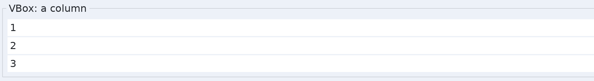
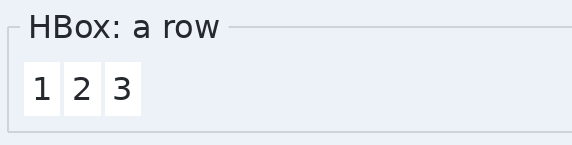

**Grid** puts children in rows and columns that line up across the whole grid.
Tracks can be sized to their content, given a fixed size, or given a weight so
they share what is left. A cell can span more than one track. This is the pane
to reach for when labels and fields have to line up.

```c
schultz_layout_params params;

schultz_node_set_pane(tree, form, schultz_pane_grid());

schultz_layout_params_default(&params);
params.row = 0u; params.column = 0u;
schultz_node_set_layout_params(tree, caption, &params);

schultz_layout_params_default(&params);
params.row = 0u; params.column = 1u;
params.column_span = 2u;                 /* across two columns */
schultz_node_set_layout_params(tree, field, &params);
```

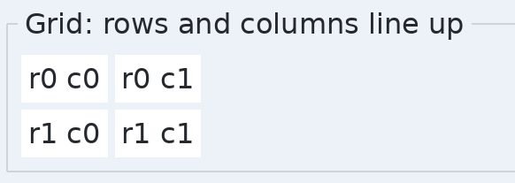

**Stack** gives every child the same rectangle and aligns each one inside it.
Badges, overlays and centred content all fall out of this.

```c
schultz_node_set_pane(tree, stack, schultz_pane_stack());
```

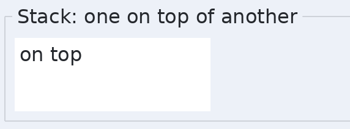

**Absolute** places each child at the coordinates you give it. Useful for a
diagram or a drawing surface, and wrong for almost everything else.

```c
schultz_layout_params params;

schultz_node_set_pane(tree, board, schultz_pane_absolute());
schultz_layout_params_default(&params);
params.x = 10.0f;
params.y = 10.0f;
schultz_node_set_layout_params(tree, piece, &params);
```

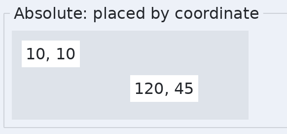

**Border** has five slots: four edges and a centre. The edges take the size
they ask for and the centre takes the rest. This is the pane for an
application's outer shell, with a menu bar at the top and a status bar at the
bottom.

```c
schultz_layout_params params;

schultz_node_set_pane(tree, shell, schultz_pane_border());

schultz_layout_params_default(&params);
params.slot = SCHULTZ_SLOT_TOP;          /* or BOTTOM, LEFT, RIGHT, CENTER */
schultz_node_set_layout_params(tree, menu_bar, &params);
```

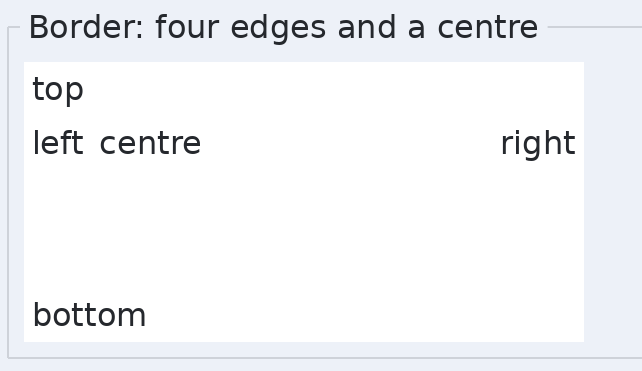

**Flow** lays children out along a row and wraps to the next when it runs out
of room. Tags, chips and a toolbar that has to survive a narrow window.

```c
schultz_node_set_pane(tree, tags, schultz_pane_flow());
schultz_node_set_spacing(tree, tags, 0.0f, 6.0f);
```

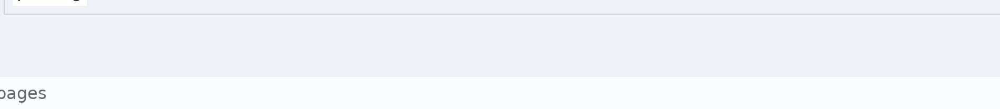

### Container widgets

**Panel** is a background, a border and a corner radius. It is the plainest
node that draws anything, and it is what most containers are underneath.

```c
schultz_handle panel = SCHULTZ_HANDLE_NONE;

schultz_panel_create(tree, parent, &panel);
```

**GroupBox** is a titled panel with its title set into the top border. Every
card on every page of the demo is one.

```c
schultz_handle box = SCHULTZ_HANDLE_NONE;

schultz_group_box_create(tree, parent, "Options", &box);

/* Fill the content node, not the group box itself. */
schultz_handle inside = schultz_group_box_content(tree, box);
```

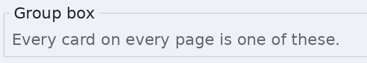

**SplitPane** holds two halves with a divider you can drag. Nest one inside
another for three or more regions.

```c
schultz_handle split = SCHULTZ_HANDLE_NONE;

schultz_split_pane_create(tree, parent, SCHULTZ_ORIENT_HORIZONTAL, &split);
schultz_split_pane_set_position(tree, split, 0.35f);   /* 0 to 1 */

schultz_handle left  = schultz_split_pane_half(tree, split, 0u);
schultz_handle right = schultz_split_pane_half(tree, split, 1u);

float where = schultz_split_pane_position(tree, split);
```

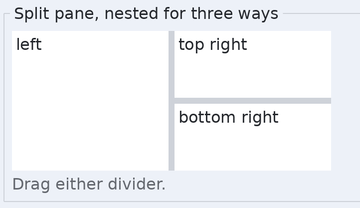

**TabView** is a strip of tabs and one page showing at a time. The live tab is
marked by the line under it rather than by a box around it.

```c
schultz_handle tabs = SCHULTZ_HANDLE_NONE;
schultz_handle page = SCHULTZ_HANDLE_NONE;

schultz_tab_view_create(tree, parent, &tabs);
schultz_tab_view_add(tree, tabs, "General", &page);   /* fill page */
schultz_tab_view_add(tree, tabs, "Advanced", &page);
schultz_tab_view_select(tree, tabs, 0u);

uint32_t showing = schultz_tab_view_selected(tree, tabs);
uint32_t count   = schultz_tab_view_count(tree, tabs);
```

A page holds one thing and sizes itself around it, like every other content
node. Put a column or a grid in it for anything more, the same way you would
in a dialog.

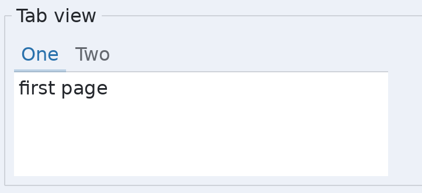

**ScrollView** is a window onto content larger than itself. It scrolls by
moving where its children are drawn rather than by laying them out again, and
it shows a bar only when one is needed.

Three things move it: a mouse wheel, a bar dragged with a cursor or a finger,
and a finger dragged across the content, which follows the finger and carries
on after a flick before slowing to a stop. A cursor deliberately does not drag
the content -- it has a wheel and a bar, and dragging is how a cursor selects
text.

A finger that lands on a row inside the view presses it if it stays still and
scrolls if it moves. It never does both.

```c
schultz_handle view = SCHULTZ_HANDLE_NONE;

schultz_scroll_view_create(tree, parent, &view);

/* Put your content in the content node, not in the view. */
schultz_handle content = schultz_scroll_view_content(tree, view);
schultz_node_set_pane(tree, content, schultz_pane_vbox());

schultz_scroll_view_scroll_to(tree, view, schultz_point_make(0.0f, 120.0f));
schultz_scroll_view_reveal(tree, view, some_child);   /* least movement */

schultz_handle bar = schultz_scroll_view_bar(tree, view,
                                             SCHULTZ_ORIENT_VERTICAL);
```

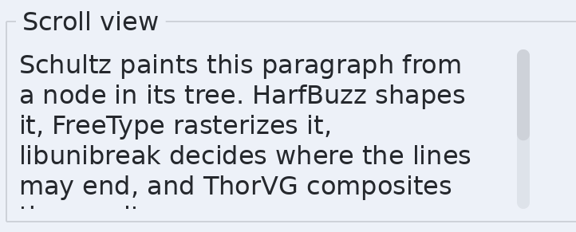

**Accordion** is a column of titled sections that open and close. It can be
told to keep only one open at a time.

```c
schultz_handle accordion = SCHULTZ_HANDLE_NONE;
schultz_handle section = SCHULTZ_HANDLE_NONE;

schultz_accordion_create(tree, parent, &accordion);
schultz_accordion_add(tree, accordion, "General", &section);  /* fill it */
schultz_accordion_set_single_expand(tree, accordion, 1);

schultz_accordion_expand(tree, accordion, header, 1);
int32_t open = schultz_accordion_is_expanded(tree, header);
```

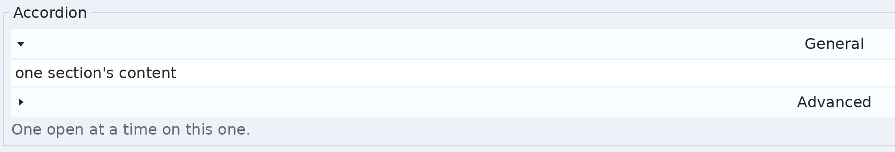

**ScrollBar** on its own, for scrolling something the toolkit is not managing.

```c
schultz_handle bar = SCHULTZ_HANDLE_NONE;

schultz_scroll_bar_create(tree, parent, SCHULTZ_ORIENT_VERTICAL, &bar);
schultz_scroll_bar_set_range(tree, bar, 2000.0f, 400.0f); /* content, view */
schultz_scroll_bar_set_value(tree, bar, 0.0f);
schultz_scroll_bar_on_change(tree, bar, on_scrolled, context);

float at  = schultz_scroll_bar_value(tree, bar);
float top = schultz_scroll_bar_maximum(tree, bar);
```

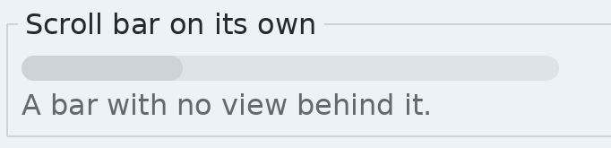

## Text

**Label** is static text. It wraps if you let it, and it can be made
selectable, which turns it into a block of prose a reader can copy from.

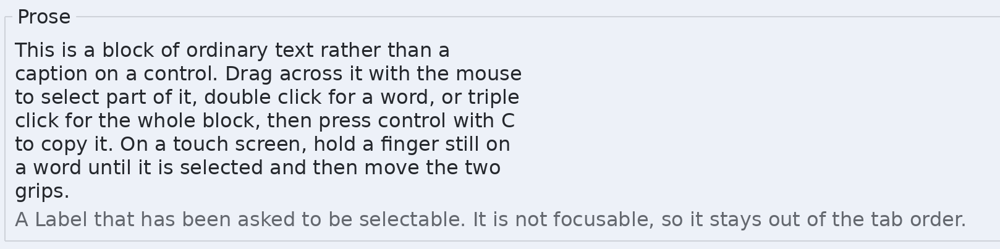

Selectable labels are worth knowing about: they are how you show a paragraph
rather than a caption. A selectable label is deliberately not focusable, so
prose in the middle of a form does not add a tab stop. Copy still reaches it.

```c
schultz_handle text = SCHULTZ_HANDLE_NONE;
uint32_t start, end;

schultz_label_create(tree, parent, "A paragraph of prose.", &text);
schultz_label_set_wrap(tree, text, 1);
schultz_label_set_selectable(tree, text, 1);
schultz_label_set_text(tree, text, "Replaced.");
schultz_label_set_ellipsize(tree, text, 1);   /* cut, do not overflow */

schultz_label_set_selection(tree, text, 0u, 8u);      /* byte offsets */
schultz_label_selection(tree, text, &start, &end);
schultz_label_copy_selection(tree, text);             /* what Ctrl+C does */
```

A label given less room than its text needs draws past the edge by default,
over whatever is beside it. `schultz_label_set_ellipsize` cuts the line where
it stops fitting and marks the cut with an ellipsis instead, which is what a
caption, a table cell or a list row wants. It never makes a label narrower:
the label still asks for the width its whole text needs, and this only decides
what happens when the layout cannot give it that width.

### Rich text inside one label

A label is one face in one colour. A **span** says that some stretch of its
text is not: that a phrase is bold, that a term is set in the code face, that
a word carries a background or a line through it.

Spans describe the text rather than act on it, so the order you give them in
does not matter, and a byte no span covers is drawn the way the label's style
says. A field left at zero means the same thing: take the label's. That keeps
the common case short.

```c
const char *words = "A bold phrase and a struck one.";
schultz_handle text = SCHULTZ_HANDLE_NONE;
schultz_span spans[2] = {0};   /* zero means "as the label is" */

schultz_label_create(tree, parent, words, &text);
spans[0].start = 2u;                 /* byte offsets into the text */
spans[0].end   = 13u;
spans[0].bold  = 1u;

spans[1].start = 18u;
spans[1].end   = 29u;
spans[1].strikethrough = 1u;

schultz_label_set_spans(tree, text, spans, 2u);
```

Bold and italic are wishes, not faces. A program cannot name the bold handle
for whatever a phrase happens to be set in, so it asks and the family answers.
Schultz has the whole DejaVu Sans family compiled in, so a Bold button works
with no setup; `schultz_font_at_style` is the call underneath, and a family
with no bold member answers with the closest face it does have rather than
leaning an upright one over.

A span may also name a `font` outright, a `size` in pixels, a `color`, a
`background`, and a `link`. The link travels with the words into the markup a
copy puts on the clipboard; see [The clipboard](concepts.md#the-clipboard)
for what a copy offers and how to put something there yourself.

### Pressing a stretch of text

Set `clickable` and a span can be pressed. That is deliberately separate from
`link`: a document being shown rather than used wants its links to look and
copy like links without being live, and a stretch that is not a link at all
may still want to be pressed, such as a keyword in a code editor or a name in
a message.

```c
schultz_handle text = SCHULTZ_HANDLE_NONE;
schultz_span spans[1] = {0};
uint64_t my_keyword_id = 17u;

schultz_label_create(tree, parent, "A bold phrase.", &text);
spans[0].start     = 2u;
spans[0].end       = 13u;
spans[0].clickable = 1u;
spans[0].tag       = my_keyword_id;   /* yours, handed straight back */
spans[0].underline = 1u;
schultz_label_set_spans(tree, text, spans, 1u);
```

A press arrives as an ordinary `SCHULTZ_EVENT_CLICK` on the label's node, with
two more fields filled in: `span` names which stretch, counting from zero, and
`span_tag` is whatever you put in `tag`. Everywhere else, and on every other
widget, `span` is `SCHULTZ_SPAN_NONE`, so you can read it without checking
what was clicked first.

Use `span_tag` to say which of your own things was pressed and `span` to reach
the span itself. The index names the list as it stood when the press happened,
so a program that rebuilds its spans before reading the event should go by the
tag.

The toolkit acts on none of it. It does not open a link any more than the
hyperlink widget does; what a press means is yours to decide.

The pointer turns to a hand over a pressable stretch, on labels that can be
selected and on labels that cannot. Dragging across the words to select them
does not press what the drag started on, and on a touch screen a tap presses
while a hold still selects.

Set the text before the spans. A span is byte offsets into the words that were
there, so changing the text clears them rather than leaving them marking
whatever now sits at those bytes.

Two things follow from spans that are worth knowing. A line is as tall as the
tallest face on it, so a larger phrase makes its own line taller and leaves
the rest alone. And a copied selection carries the styling: bold arrives as
`<strong>`, a link as an anchor, colours and sizes as a style attribute. A
screen reader is told as well, because each span becomes a text run of its own
with its weight, slant, colours and rules on it.

### Selecting across more than one widget

A selectable label owns its own selection: press in it, drag inside it, copy
it. Drag from it into the next paragraph and the drag stops at the edge,
because the label that took the press is the only thing told about the motion
afterwards.

A **selection area** changes that for the part of the tree underneath it. Wrap
a subtree, and a drag inside it runs from where it started to where it is now,
across as many widgets as it crosses:

```c
schultz_handle area = SCHULTZ_HANDLE_NONE;
schultz_handle first = SCHULTZ_HANDLE_NONE;
schultz_handle second = SCHULTZ_HANDLE_NONE;

schultz_selection_area_create(tree, parent, &area);
schultz_node_set_pane(tree, area, schultz_pane_vbox());

schultz_label_create(tree, area, "The first paragraph.", &first);
schultz_label_set_selectable(tree, first, 1);
schultz_label_create(tree, area, "The second one.", &second);
schultz_label_set_selectable(tree, second, 1);
```

That is the whole of the setup. The area draws nothing and takes no room; give
it a pane and children like any other container.

**It is opt in on purpose.** A drag usually already means something -- scroll a
list, reorder a row, move a card -- and only the host knows which. So nothing
changes anywhere you have not asked for it.

**Controls do not take part.** A button's caption, a tab title, a menu item:
these are labels on machine parts rather than things written to be read, and a
drag passing over them leaves them alone. What takes part is a widget that
says it can, and today that means a label you made selectable.

**Areas nest, and an inner one keeps its own selection.** The outer area
cannot reach into it and it cannot reach out, which is how a text field inside
a selectable page behaves correctly.

**Copying** gives the pieces in reading order with a line break between one
widget's text and the next, because two paragraphs pasted together with
nothing between them read as one sentence:

```c
schultz_handle area = SCHULTZ_HANDLE_NONE;
const char *text;

schultz_selection_area_copy(tree, area, NULL);  /* what Ctrl+C does */
text = schultz_selection_area_text(tree, area); /* the same, without the
                                                 * clipboard */
```

**A selection can hold a picture too.** Make an Icon selectable and a drag
takes it like anything else. A picture adds nothing to the plain text, so a
paste into a text box is unchanged; it is only worth something to a format
that can carry one, and is only built when such a format is asked for:

```c
schultz_handle area = SCHULTZ_HANDLE_NONE;
schultz_handle picture = SCHULTZ_HANDLE_NONE;
schultz_render_options options;
const void *bytes;
uint64_t length;

schultz_icon_set_selectable(tree, picture, 1);

/* Offers the text and the picture together. The paste target picks. */
schultz_selection_area_copy(tree, area, &options);

/* Or take the picture directly, as a PNG. */
schultz_selection_area_picture(tree, area, SCHULTZ_IMAGE_PNG, &options,
                               &bytes, &length);
```

The render options are the fonts, glyphs, images and resources a draw needs.
Passing NULL takes them from the tree, which is what the Ctrl+C key does, so a
picture in the selection reaches the clipboard without the host arranging
anything.

**A copy offers several formats and the paste target picks.** Nobody chooses
at copy time:

| Format | What it is | When it is offered |
|---|---|---|
| `text/html` | The words with their sizes, colours and faces, and every picture inside the document | always |
| `text/plain;charset=utf-8` | The words alone, in reading order | always |
| `image/png` | The picture | only when the selection is a picture and nothing else |

**The markup comes first** because a program pasting takes the first format it
recognises, so the one that carries everything has to lead. Plain text is the
fallback, for a box that can hold nothing else and for somebody who asked for
it by name.

**A picture on its own is offered only when the selection is a picture.** A
selection of a page with three pictures in it is not any one of them, and a
paste that silently became the first one is worse than no offer at all. When
the selection is just a picture, that is what it is, and a program that can
only take a picture gets one.

**The markup is what a word processor takes.** Each widget's share becomes a
paragraph carrying the size and colour it resolved to, and a monospace family
when the face is a code face. Pictures are written into the document as
`data:` URIs, so a selection holding two of them arrives as two of them --
the picture formats above can only ever carry one.

The styles come from each widget's *resolved* style rather than from the
theme, so a host that set a colour on one paragraph keeps it in the paste.

```c
schultz_handle area = SCHULTZ_HANDLE_NONE;
const char *markup;

markup = schultz_selection_area_html(tree, area);
```

Base64 adds about a third to every picture, so the byte budget below is
reached sooner in this format than in any other.

Pictures reach the clipboard on the desktop. On Android and iOS the clipboard
underneath carries text and nothing else, so the same selection there gives
the text and leaves the picture behind.

**How much a copy may produce** is a byte budget, twenty megabytes by default.
Bytes rather than characters, because once a picture can be in a selection a
character count stops describing the cost. Text never comes near it. A copy
that would pass it stops on a whole block rather than mid-sentence, and says
so:

```c
schultz_handle area = SCHULTZ_HANDLE_NONE;

schultz_selection_area_set_limit(tree, area, 4u * 1024u * 1024u);
if (schultz_selection_area_was_cut(tree, area)) {
    /* tell the person that what they copied is not all they selected */
}
```

A host can also drive the range directly, which is what a Select All menu item
would do:

```c
schultz_handle area = SCHULTZ_HANDLE_NONE;
schultz_handle first = SCHULTZ_HANDLE_NONE;
schultz_handle last = SCHULTZ_HANDLE_NONE;
schultz_handle from, to;
uint32_t from_at, to_at;

schultz_selection_area_set_range(tree, area, first, 0u, last, 4u);
schultz_selection_area_ends(tree, area, &from, &from_at, &to, &to_at);
schultz_selection_area_clear(tree, area);
```

The two ends may be given in either order. Dragging backwards is an ordinary
thing to do, so the area sorts them into reading order rather than asking the
caller to; `schultz_selection_area_ends` always answers in that order.

**One thing not built yet.** Selecting across widgets with a finger. Touch
selection starts with a hold rather than a drag, because dragging a finger
across text is how a page is scrolled, and that hold currently lives on the
label. So inside an area a mouse selects across widgets and a finger still
selects within one.

**Separator** is a single rule, across or down.

```c
schultz_handle rule = SCHULTZ_HANDLE_NONE;

schultz_separator_create(tree, parent, SCHULTZ_ORIENT_HORIZONTAL, &rule);
```

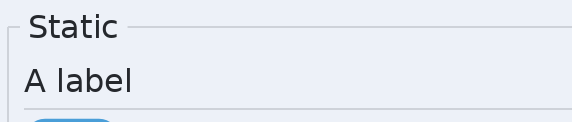

## Buttons

**Button** is a box with a centred caption. A caption too wide for the box is
cut short with an ellipsis rather than drawn over the button beside it.

```c
schultz_handle button = SCHULTZ_HANDLE_NONE;

schultz_button_create(tree, parent, "Click me", &button);
schultz_node_set_token(tree, button, 1u);       /* comes back on the event */

/* The caption is a Label inside it, if you want to change it later. Toggle
   buttons and menu buttons answer the same call; a menu row is not a button,
   so it has schultz_menu_item_label. */
schultz_label_set_text(tree, schultz_button_label(tree, button), "Clicked");
```

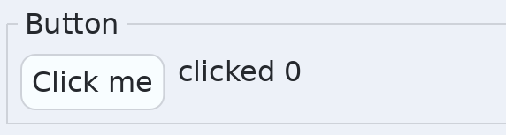

**Hyperlink** is a button drawn as a link. The toolkit opens nothing; the click
reaches you.

```c
schultz_handle link = SCHULTZ_HANDLE_NONE;

schultz_hyperlink_create(tree, parent, "Open the handbook", &link);
schultz_hyperlink_set_text(tree, link, "Open the manual");
schultz_hyperlink_set_visited(tree, link, 1);
int32_t seen = schultz_hyperlink_is_visited(tree, link);
```

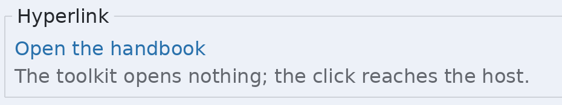

**ToggleButton** stays pressed. Put several in a group and choosing one clears
the rest.

```c
schultz_handle left = SCHULTZ_HANDLE_NONE;

/* The last argument is a group number of your choosing. Zero means the
 * button belongs to no group and toggles on its own. */
schultz_toggle_button_create(tree, parent, "Left", 1u, &left);
schultz_toggle_button_select(tree, left);
int32_t on = schultz_toggle_button_is_selected(tree, left);
```

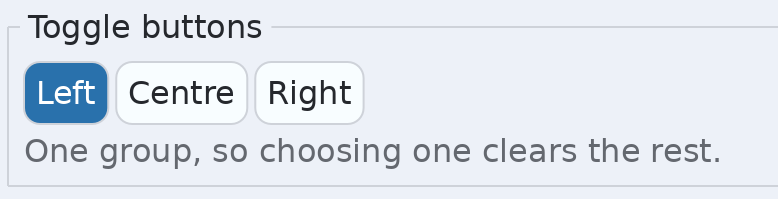

**ButtonBar** is a row of buttons ordered by convention rather than by the
order you added them. You say which button is OK, which is Cancel and which is
Help, and the bar puts them where the platform expects.

```c
schultz_handle bar = SCHULTZ_HANDLE_NONE;
schultz_handle ok = SCHULTZ_HANDLE_NONE;

schultz_button_bar_create(tree, parent, &bar);
schultz_button_bar_add(tree, bar, "OK", SCHULTZ_BUTTON_ROLE_OK, &ok);
schultz_button_bar_add(tree, bar, "Cancel", SCHULTZ_BUTTON_ROLE_CANCEL, NULL);
schultz_button_bar_add(tree, bar, "Help", SCHULTZ_BUTTON_ROLE_HELP, NULL);

schultz_button_bar_set_order(tree, bar, SCHULTZ_BUTTON_ORDER_LINUX);
schultz_button_bar_set_uniform_width(tree, bar, 1);
```

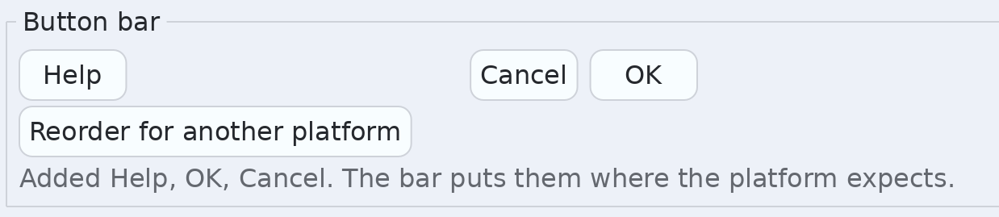

| Role | Where it goes |
|---|---|
| `SCHULTZ_BUTTON_ROLE_OK`, `_CANCEL`, `_YES`, `_NO`, `_APPLY` | The accepting side, in the platform's order |
| `SCHULTZ_BUTTON_ROLE_HELP`, `_LEFT` | The far side, away from the rest |
| `SCHULTZ_BUTTON_ROLE_OTHER` | In the order it was added |

Order is `SCHULTZ_BUTTON_ORDER_WINDOWS`, `_MACOS` or `_LINUX`.

## Toggles

**Checkbox** is a tick box with a caption. **Switch** is the same thing drawn
as a sliding track. **Radio** is one of a mutually exclusive set.

```c
schultz_handle check = SCHULTZ_HANDLE_NONE;
schultz_handle toggle = SCHULTZ_HANDLE_NONE;
schultz_handle first = SCHULTZ_HANDLE_NONE;

schultz_checkbox_create(tree, parent, "Remember me", &check);
schultz_switch_create(tree, parent, "Play sounds", &toggle);
schultz_radio_create(tree, parent, "First", 1u, &first);   /* group 1 */

/* Checkbox, switch and radio all share these two. */
schultz_toggle_set_checked(tree, check, 1);
int32_t on = schultz_toggle_checked(tree, check);

schultz_radio_select(tree, first);        /* clears the rest of group 1 */
```

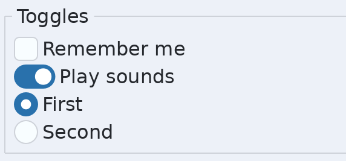

## Values

**Slider** is a value dragged along a track. **ProgressBar** is a track with a
filled portion, for work whose length you know.

```c
schultz_handle slider = SCHULTZ_HANDLE_NONE;
schultz_handle progress = SCHULTZ_HANDLE_NONE;
schultz_handle upright = SCHULTZ_HANDLE_NONE;

schultz_slider_create(tree, parent, SCHULTZ_ORIENT_HORIZONTAL,
                      0.0f, 100.0f, 50.0f, &slider);
schultz_slider_set_step(tree, slider, 5.0f);     /* what an arrow key moves */
schultz_slider_set_value(tree, slider, 75.0f);
float value = schultz_slider_value(tree, slider);

schultz_progress_bar_create(tree, parent, SCHULTZ_ORIENT_HORIZONTAL,
                            &progress);
schultz_progress_bar_set_value(tree, progress, 0.4f);          /* 0 to 1 */
schultz_progress_bar_set_indeterminate(tree, progress, 1);     /* unknown */

/* Either widget runs the other way instead. */
schultz_slider_create(tree, parent, SCHULTZ_ORIENT_VERTICAL,
                      0.0f, 100.0f, 50.0f, &upright);
```

Both take an orientation, like the separator, the scroll bar, the toolbar and
the split pane. A vertical one is long down and thin across, the two extents
simply swapped. It counts **upward**: the minimum is at the bottom, a bar
fills from the bottom, and up and right still step forward while down and left
step back, so the keys mean the same thing whichever way round the widget is.

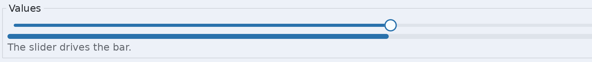

**NumberField** is a text field with a down and an up button beside it. Each
is a square as tall as the row, so a finger can tell them apart. Holding a
step repeats it, and text that is not a number is put back.

```c
schultz_handle number = SCHULTZ_HANDLE_NONE;

schultz_number_field_create(tree, parent, 0.0, 100.0, 25.0, &number);
schultz_number_field_set_step(tree, number, 1.0);
schultz_number_field_set_decimals(tree, number, 2u);
schultz_number_field_set_range(tree, number, -50.0, 50.0);
schultz_number_field_set_wrap(tree, number, 1);   /* past the end, round */
schultz_number_field_set_value(tree, number, 12.5);

schultz_handle field = schultz_number_field_text_field(tree, number);

/* Tall instead of wide: up over the field and down under it. */
schultz_number_field_set_steps(tree, number, SCHULTZ_STEPS_ABOVE_BELOW);
```

`SCHULTZ_STEPS_BESIDE` is the default and is what a number on its own wants.
`SCHULTZ_STEPS_ABOVE_BELOW` is for several of them side by side, where three
fields each twice their own width will not fit. Note that a preferred width
set on a number field means the whole widget, so the same number leaves a
much wider field above and below than it does beside.

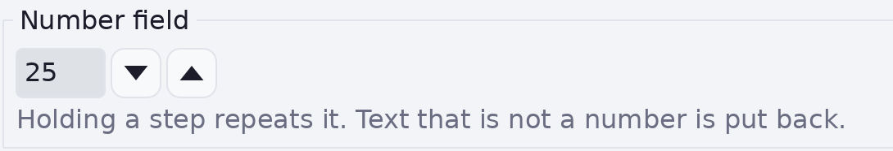

**BusyIndicator** is a spinning arc, for work whose length you do not know.

```c
schultz_handle busy = SCHULTZ_HANDLE_NONE;

schultz_busy_indicator_create(tree, parent, &busy);
schultz_busy_indicator_set_size(tree, busy, 24.0f);
schultz_busy_indicator_start(tree, busy);
schultz_busy_indicator_stop(tree, busy);
int32_t spinning = schultz_busy_indicator_is_running(tree, busy);
```

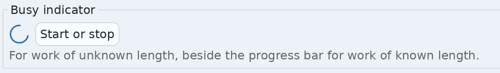

## Text entry

**TextField** is one line of editable text, with selection, undo, and cut,
copy and paste.

```c
schultz_handle field = SCHULTZ_HANDLE_NONE;
uint32_t anchor, caret;

schultz_text_field_create(tree, parent, "type here", &field);

/* These three work on a text field, a text area and a password field. */
schultz_text_set(tree, field, "replaced");
const char *now = schultz_text_get(tree, field);
schultz_text_set_selection(tree, field, 0u, 8u);
schultz_text_selection(tree, field, &anchor, &caret);
```

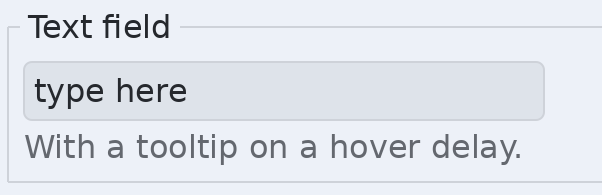

**TextArea** is wrapped, scrolling, editable text.

```c
schultz_handle area = SCHULTZ_HANDLE_NONE;

schultz_text_area_create(tree, parent, "Wrapped, scrolling text.", &area);
schultz_text_area_set_visible_lines(tree, area, 4u);  /* how tall it asks */
schultz_text_area_set_grows(tree, area, 1);           /* or grow with text */
```

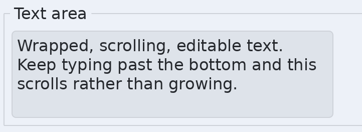

### Rich text you can edit

The same spans a Label takes work on text that can be edited, and everything
moves with the words. A stretch marked bold stays on the same characters,
grows when something is typed inside it, and goes when those characters go.
Undo gives back the look along with the words.

```c
schultz_handle area = SCHULTZ_HANDLE_NONE;
schultz_span bold = {0};
uint32_t anchor = 0u;
uint32_t caret = 0u;

schultz_text_area_create(tree, parent, "Wrapped, editable text.", &area);
bold.bold = 1u;
schultz_text_selection(tree, area, &anchor, &caret);
if (anchor != caret) {
    /* Something is selected, so mark it. */
    schultz_text_field_set_span(tree, area, anchor, caret, &bold);
} else {
    /* Nothing is selected, so mark what comes next. */
    schultz_text_field_set_typing(tree, area, &bold);
}
```

Those two calls are the two halves of a Bold button. `set_span` marks a range
and splits whatever it lands in the middle of; `set_typing` remembers a look
and gives it to the next thing typed, which is the only thing a button can
mean when there is nothing selected yet. Moving the caret forgets it.

Without `set_typing`, typing takes after the character before the caret. That
is what continues a bold word when more is added to the end of it, and what
keeps text typed in front of one out of it.

Touching stretches that say the same thing are merged, so typing a paragraph
one character at a time does not leave one span per character. Two stretches
with different `tag` values are never merged, because a program that named
them separately meant them as two things.

Pass NULL to `set_span` to strip a range back to plain, and use
`schultz_text_field_set_spans` to replace the whole list at once.

A masked field is drawn plain whatever its spans say. The dots are not the
text the spans describe, and colouring three of them would say where the
marked part of the secret is.

An editable widget also takes part in a selection that spans widgets, so a
drag that began outside it and passed over marks its words too, and copying
that selection carries them with whatever they look like. Pressing inside it
still places a caret and dragging inside it still selects its own text to
edit; what joining adds is only the other direction. A masked field takes no
part at all, because its own copy already refuses to hand over the secret and
joining a selection that copies would be a way round that refusal.

Copying from the widget on its own, with Ctrl+C, puts plain text on the
clipboard. Formatting travels with a selection area's copy, which is where a
document rather than a control is being taken.

**PasswordField** is a text field with masking already on. Cut and copy are
refused while it is masked.

```c
schultz_handle password = SCHULTZ_HANDLE_NONE;

schultz_password_field_create(tree, parent, "hunter2", &password);

/* Masking is a property of any text field. Zero turns it off. */
schultz_text_field_set_mask(tree, field, SCHULTZ_PASSWORD_MASK);
uint32_t mask = schultz_text_field_mask(tree, field);
```

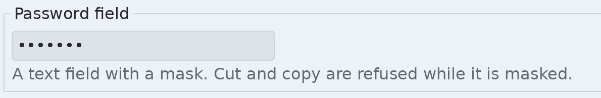

### The on-screen keyboard

A keyboard Schultz draws, for a machine with a touch screen and no keys. A
Raspberry Pi started on the framebuffer is the case it exists for: SDL offers
a screen keyboard on Android, iOS and a few consoles, and on a Linux
framebuffer it offers none, so without this a text field there cannot be typed
into at all.

The ordinary way to get one is to ask the window for it. It comes up when a
text widget takes focus, goes when focus leaves, and while it is up the
content slides so the field being edited stays visible.

```c
schultz_keyboard_options keys;

schultz_keyboard_options_init(&keys);
keys.policy = SCHULTZ_KEYBOARD_WHEN_NEEDED;
keys.emoji  = 1;
schultz_window_set_keyboard(window, &keys);
```

`SCHULTZ_KEYBOARD_WHEN_NEEDED` draws one only where the machine has no keys of
its own, which is the setting nearly every application wants: a desktop gets
nothing, a bare touch panel gets a keyboard. `SCHULTZ_KEYBOARD_ALWAYS` draws
one even where there is a keyboard, which is useful for seeing it on a
desktop. `SCHULTZ_KEYBOARD_NEVER` is the default, and is what a window that
never asks gets.

A phone is left alone. Android and iOS have their own keyboards and know more
about typing in your language than this does.

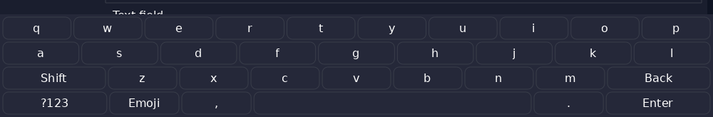

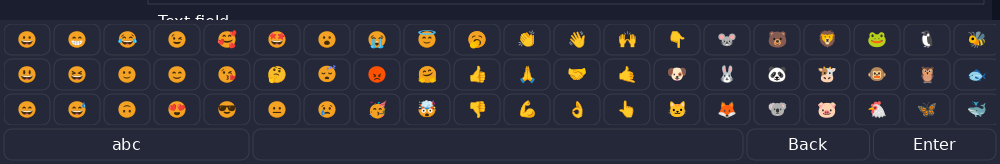

Four sets of keys: lower case, upper case behind shift, numbers and
punctuation, and a page of emoji. Shift once gives one capital, twice holds
them down, and a third press lets them go.

The emoji are grouped the way a phone groups them -- faces, then gestures,
animals, food, places, activities, objects and symbols -- three to a column in
a field that scrolls sideways, so a finger drags along the list and a tap
enters the face it landed on -- a finger that moves has swiped, and nothing
is entered, which is what every phone does. On a machine with a mouse the
cursor drags them the same way, so the gesture can be tried without a touch
screen, and a wheel turns them sideways since there is nowhere for that view
to go downwards. Any view can be told to let a cursor drag it with
`schultz_scroll_view_set_drag_scrolls`. The field shows no scroll bars: the strip they
would take is height three rows of faces cannot spare, and a bar is not what
anyone reaches for on a touch panel. Any view can be told the same with
`schultz_scroll_view_set_bars`. They draw from the colour face compiled into the
library, so they need nothing loaded and arrive in the field as ordinary
text.

A field says what it will take, and it has the last word:

```c
schultz_text_field_set_input_type(tree, field, SCHULTZ_INPUT_NUMBER);
```

A number field opens on the digits and is offered no emoji, and neither is a
password field or any field with a mask on it, whatever the window asked for.
The two answers are kept apart on purpose: an application says whether this
window offers emoji at all, a field says whether it accepts them, and either
one saying no is a no.

A host that would rather place a keyboard itself can build one directly with
`schultz_keyboard_create` and put it where it likes. Presses go out through
`schultz_events_text_input` and `schultz_events_key`, which are the calls the
platform layer makes for a real keyboard, so nothing downstream can tell the
two apart. That is also how to build a keypad of your own: a row of buttons
that call those two is a keyboard as far as every widget is concerned.

## Choosing from a set

**ComboBox** is a button showing the current choice, and a menu of the others.

```c
schultz_handle combo = SCHULTZ_HANDLE_NONE;

schultz_combo_box_create(tree, parent, &combo);
schultz_combo_box_add(tree, combo, "Comfortable");
schultz_combo_box_add(tree, combo, "Compact");
schultz_combo_box_select(tree, combo, 0u);

uint32_t chosen = schultz_combo_box_selected(tree, combo);
uint32_t count  = schultz_combo_box_count(tree, combo);
schultz_handle menu = schultz_combo_box_menu(tree, combo);
```

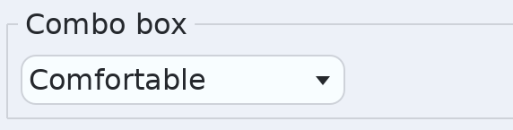

**ListView** is a scrolling column of rows you fill. It can select one row or
several, and the arrow keys walk it.

```c
schultz_handle list = SCHULTZ_HANDLE_NONE;
schultz_handle row = SCHULTZ_HANDLE_NONE;

schultz_list_view_create(tree, parent, &list);
schultz_list_view_set_selection_mode(tree, list, SCHULTZ_SELECT_MULTIPLE);

/* A row is a node you fill with whatever you like. */
schultz_list_view_add(tree, list, &row);
schultz_label_create(tree, row, "Anchovies", NULL);

schultz_list_view_select(tree, list, 0u);
schultz_list_view_select_range(tree, list, 0u, 2u);
schultz_list_view_deselect(tree, list, 1u);
schultz_list_view_scroll_to(tree, list, 5u);

int32_t first = schultz_list_view_selected(tree, list);      /* -1 if none */
uint32_t many = schultz_list_view_selected_count(tree, list);
int32_t nth   = schultz_list_view_selected_at(tree, list, 0u);
schultz_list_view_remove(tree, list, 0u);
schultz_list_view_clear(tree, list);
```

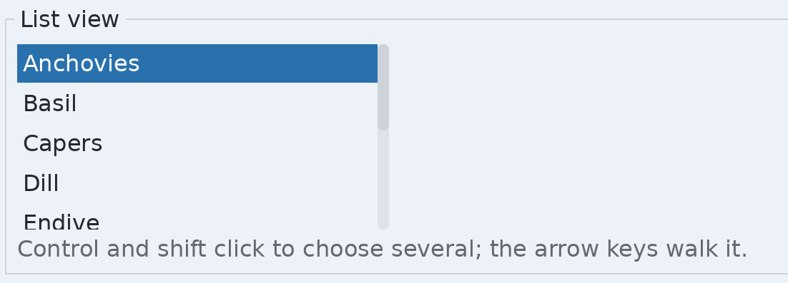

Selection modes are `SCHULTZ_SELECT_NONE`, `SCHULTZ_SELECT_SINGLE` and
`SCHULTZ_SELECT_MULTIPLE`.

**TreeView** is a list view whose rows hold rows. Right opens a branch, left
closes it.

```c
schultz_handle view = SCHULTZ_HANDLE_NONE;
schultz_handle folder = SCHULTZ_HANDLE_NONE;
schultz_handle file = SCHULTZ_HANDLE_NONE;

schultz_tree_view_create(tree, parent, &view);
schultz_tree_view_set_indent(tree, view, 16.0f);

/* SCHULTZ_HANDLE_NONE as the parent row makes a root row. */
schultz_tree_view_add(tree, view, SCHULTZ_HANDLE_NONE, &folder);
schultz_tree_view_add(tree, view, folder, &file);

schultz_tree_view_expand(tree, view, folder, 1);
int32_t open = schultz_tree_view_is_expanded(tree, folder);
uint32_t deep = schultz_tree_view_depth(tree, file);

schultz_tree_view_select(tree, view, file);
schultz_handle chosen = schultz_tree_view_selected(tree, view);
schultz_tree_view_scroll_to(tree, view, file);
schultz_tree_view_remove(tree, view, folder);
```

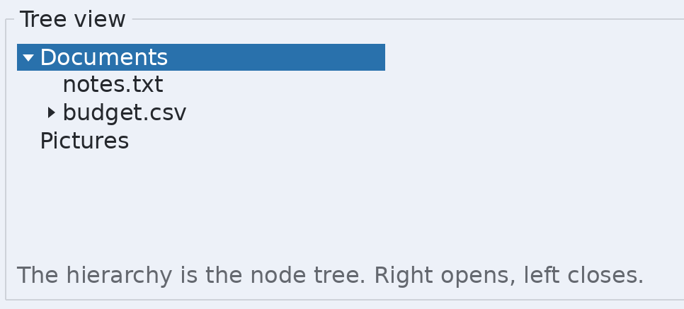

**Pagination** is steps and numbers for moving between pages. The run of
numbers follows the current page and the two ends stay reachable.

```c
schultz_handle pages = SCHULTZ_HANDLE_NONE;

schultz_pagination_create(tree, parent, 24u, &pages);
schultz_pagination_set_current(tree, pages, 3u);       /* counts from zero */
schultz_pagination_set_page_count(tree, pages, 40u);

uint32_t at    = schultz_pagination_current(tree, pages);
uint32_t total = schultz_pagination_page_count(tree, pages);
```

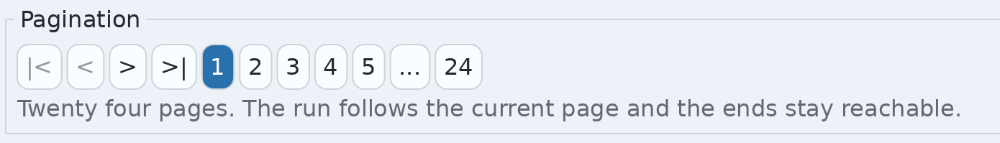

## Menus

**Menu** is hidden until it is opened, and it can be opened anywhere, which is
what makes it a context menu as well.

```c
schultz_handle menu = SCHULTZ_HANDLE_NONE;
schultz_handle item = SCHULTZ_HANDLE_NONE;

/* A menu has no parent: it hangs off the root so it can appear anywhere. */
schultz_menu_create(tree, &menu);
schultz_menu_add(tree, menu, "Save", "Ctrl+S", &item);

schultz_menu_open_for(tree, menu, button, SCHULTZ_PLACE_BELOW);
schultz_menu_open_at(tree, menu, schultz_point_make(120.0f, 80.0f));
schultz_menu_close(tree, menu);
int32_t showing = schultz_menu_is_open(tree, menu);
```

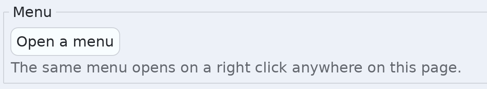

Placement is `SCHULTZ_PLACE_BELOW`, `_ABOVE`, `_RIGHT`, `_LEFT` or `_OVER`.
`schultz_menu_open_at` puts it at a point, which is what a right click wants.

A menu row can be any of six kinds: a plain choice, a tick, a radio dot, a
separator, a submenu, or a custom row holding whatever you put in it.

```c
schultz_handle item = SCHULTZ_HANDLE_NONE;
schultz_handle sub = SCHULTZ_HANDLE_NONE;
schultz_handle content = SCHULTZ_HANDLE_NONE;

schultz_menu_add(tree, menu, "Open", "Ctrl+O", &item);
schultz_menu_add_check(tree, menu, "Word wrap", NULL, 1, &item);
schultz_menu_add_radio(tree, menu, "Metric", NULL, 1u, &item);  /* group 1 */
schultz_menu_add_separator(tree, menu, NULL);
schultz_menu_add_submenu(tree, menu, "Recent", &sub);
schultz_menu_add_custom(tree, menu, &content);   /* fill it yourself */

schultz_menu_item_set_checked(tree, item, 1);
int32_t ticked = schultz_menu_item_checked(tree, item);
int32_t kind   = schultz_menu_item_kind(tree, item);
schultz_menu_radio_select(tree, item);
```

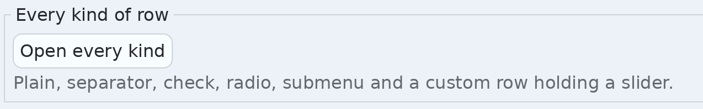

**MenuButton** opens a menu when clicked. **SplitMenuButton** is a button
beside an arrow: the wide part acts, the arrow opens the menu.

```c
schultz_handle actions = SCHULTZ_HANDLE_NONE;
schultz_handle save = SCHULTZ_HANDLE_NONE;

schultz_menu_button_create(tree, parent, "Actions", &actions);
schultz_menu_add(tree, schultz_menu_button_menu(tree, actions),
                 "Duplicate", NULL, NULL);

schultz_split_menu_button_create(tree, parent, "Save", &save);
schultz_menu_add(tree, schultz_menu_button_menu(tree, save),
                 "Save as...", NULL, NULL);
```

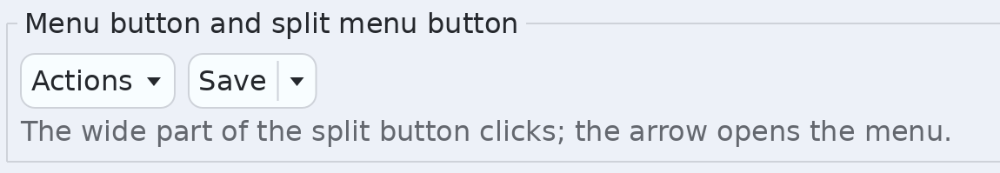

**MenuBar** is a row of titles, each dropping a menu. **Toolbar** is a row of
actions with consistent spacing. **StatusBar** is a message that stretches,
with sections beside it.

```c
schultz_handle bar = SCHULTZ_HANDLE_NONE;
schultz_handle file_menu = SCHULTZ_HANDLE_NONE;

schultz_menu_bar_create(tree, parent, &bar);
schultz_menu_bar_add(tree, bar, "File", &file_menu);
schultz_menu_add(tree, file_menu, "Quit", "Ctrl+Q", NULL);
schultz_menu_bar_close(tree, bar);
```

```c
schultz_handle toolbar = SCHULTZ_HANDLE_NONE;
schultz_handle action = SCHULTZ_HANDLE_NONE;

schultz_toolbar_create(tree, parent, SCHULTZ_ORIENT_HORIZONTAL, &toolbar);
schultz_toolbar_add(tree, toolbar, "New", &action);
schultz_toolbar_add_separator(tree, toolbar, NULL);
schultz_toolbar_set_overflow_enabled(tree, toolbar, 1);
uint32_t hidden = schultz_toolbar_overflow_count(tree, toolbar);
```

```c
schultz_handle status = SCHULTZ_HANDLE_NONE;

schultz_status_bar_create(tree, parent, &status);
schultz_status_bar_set_message(tree, status, "Ready");
schultz_status_bar_flash(tree, status, "Saved", 2000u);  /* then goes back */
schultz_status_bar_add_section(tree, status, some_label);
```

The demo's own menu bar, toolbar and status bar are visible in every
screenshot on this page: the `File View` row at the top, the buttons under it,
and the line along the bottom.

## Overlays

An overlay is only on screen while it is open, so the pictures below show the
control that opens it rather than the thing itself.

**Dialog** is a titled panel over a scrim that covers the window. It is modal:
a press beside it is swallowed rather than passed through.

```c
schultz_handle dialog = SCHULTZ_HANDLE_NONE;

/* A dialog has no parent: it covers the window. */
schultz_dialog_create(tree, "Settings", &dialog);

schultz_handle content = schultz_dialog_content(tree, dialog);
schultz_node_set_pane(tree, content, schultz_pane_vbox());

schultz_dialog_open(tree, dialog);
schultz_dialog_close(tree, dialog);
int32_t showing = schultz_dialog_is_open(tree, dialog);
```

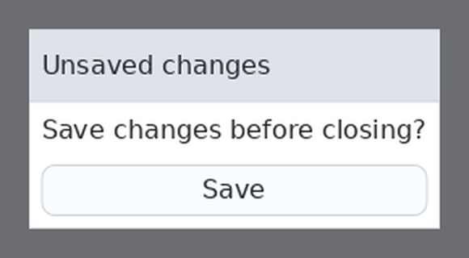

**MessageDialog** is an icon, a message, and a standard set of buttons.
**TextInputDialog** is a message dialog holding one text field, and
**ChoiceDialog** holds one list of choices. All three answer through the event
queue rather than by blocking.

```c
schultz_handle ask = SCHULTZ_HANDLE_NONE;
schultz_handle rename = SCHULTZ_HANDLE_NONE;
schultz_handle units = SCHULTZ_HANDLE_NONE;

schultz_message_dialog_create(tree, "Delete?", SCHULTZ_DIALOG_ICON_QUESTION,
                              SCHULTZ_DIALOG_YES_NO_CANCEL, &ask);
schultz_message_dialog_set_text(tree, ask, "Delete this file?",
                                "This cannot be undone.");
schultz_message_dialog_open(tree, ask);
uint32_t answer = schultz_message_dialog_result(tree, ask); /* a button role */

schultz_text_input_dialog_create(tree, "Rename", &rename);
schultz_text_input_dialog_set_value(tree, rename, "untitled");
schultz_text_input_dialog_set_allow_empty(tree, rename, 0);
const char *typed = schultz_text_input_dialog_value(tree, rename);

schultz_choice_dialog_create(tree, "Units", &units);
schultz_choice_dialog_add(tree, units, "Metric");
schultz_choice_dialog_add(tree, units, "Imperial");
schultz_choice_dialog_select(tree, units, 0u);
uint32_t picked = schultz_choice_dialog_selected(tree, units);
```

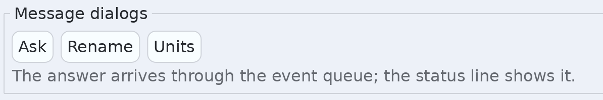

| | |
|---|---|
| Icons | `SCHULTZ_DIALOG_ICON_NONE`, `_INFO`, `_WARNING`, `_ERROR`, `_QUESTION` |
| Button sets | `SCHULTZ_DIALOG_OK`, `_OK_CANCEL`, `_YES_NO`, `_YES_NO_CANCEL` |

The result is a button role, so compare it with `SCHULTZ_BUTTON_ROLE_YES` and
the rest. All three open without blocking; the answer arrives as an event.

**Popup** is a panel that floats over the page, anchored to a node. It is
what a date picker's calendar and a combo box's list are built from, and it
is the thing a popover and a tooltip are made of.

There is one type here and several ways to start one. `schultz_popup_create`
makes the plain panel; `schultz_popover_create` makes one dressed as a bubble
with a triangle; `schultz_tooltip_create` makes one holding a line of text.
After that they are all popups, and the same calls drive all three.

```c
schultz_handle popup = SCHULTZ_HANDLE_NONE;

/* Nonzero captures presses outside it, which is what a menu wants. */
schultz_popup_create(tree, 1, &popup);

schultz_handle content = schultz_popup_content(tree, popup);
schultz_label_create(tree, content, "Anchored here.", NULL);

schultz_popup_open(tree, popup, button);   /* above it, pointing down */
schultz_popup_close(tree, popup);
int32_t showing = schultz_popup_is_open(tree, popup);
```

A **popover** is a popup that points at what opened it. Swap the one call and
everything else is the same:

```c
schultz_handle bubble = SCHULTZ_HANDLE_NONE;

schultz_popover_create(tree, 1, &bubble);  /* then popup_open, popup_close */
```

It carries the triangle, sits centred on what it was opened against, and is
drawn in the colours opposite the page so that it reads as being in front of
the page rather than part of it. A plain popup keeps the page's own surface,
which is what a dropdown full of controls wants.

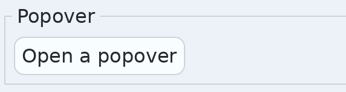

A popover goes above what it was opened against, centred on it, with a little
triangle pointing back down at it, so the control it is about stays in view
rather than under the bubble. It flips below only when there is no room above.

For a plain panel dropped under a control instead, which is what a date
picker's calendar is, make a popup rather than a popover and name the side:

```c
schultz_handle dropdown = SCHULTZ_HANDLE_NONE;

schultz_popup_create(tree, 1, &dropdown);
schultz_popup_open_at(tree, dropdown, button, SCHULTZ_PLACE_BELOW);
```

A popup has no triangle to begin with, so nothing has to be turned off.
`schultz_popup_set_arrow` adds or removes one afterwards, for a case that
starts as one and wants the other.

`schultz_popup_set_gap` changes the clearance they all keep from what they
belong to, for the whole toolkit at once. It is four by default.

**Tooltip** is a small panel holding one line, shown when the pointer rests on
a node. It never takes the pointer or the keyboard.

```c
schultz_handle tip = SCHULTZ_HANDLE_NONE;

schultz_tooltip_create(tree, "What this button does", &tip);
schultz_tooltip_watch(tree, tip, button, 600u);   /* after 600 ms resting */
```

It appears below the widget and lines its leading edge up with the pointer,
which is where the reader is looking, rather than with the widget's far
corner. With no pointer to line up with, which is a touch screen, it is
centred on the widget instead. Like a popover it flips to the other side
sooner than be cut off by the bottom of the window, and it has no triangle:
it arrives at the pointer, and the pointer is the arrow.

**Toast** appears, says one thing, and takes itself away. Several at once stack
along the bottom.

```c
schultz_handle toast = SCHULTZ_HANDLE_NONE;

schultz_toast_set_position(SCHULTZ_TOAST_BOTTOM);   /* or _TOP. Global. */
schultz_toast_show(tree, "Saved", 2500u, &toast);
int32_t showing = schultz_toast_is_showing(tree, toast);
schultz_toast_dismiss(tree, toast);
```

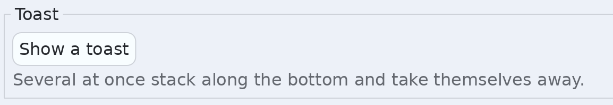

**File dialogs** are the platform's own picker, not a Schultz window. The
answer arrives through the event queue, because a file dialog comes back long
after the call that opened it. See
[Files the person chooses](concepts.md#files-the-person-chooses) for the
calls, the filters, and what iOS does differently.

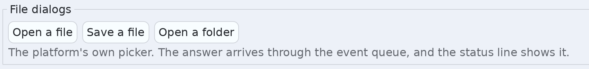

## Pickers

**DatePicker** is a field beside a calendar in a popover. Dates are three
integers, never a `time_t`.

```c
schultz_handle date = SCHULTZ_HANDLE_NONE;
int32_t year, month, day;
static const char *const days[7] = { "Mo","Tu","We","Th","Fr","Sa","Su" };

schultz_date_picker_create(tree, parent, &date);
schultz_date_picker_set_date(tree, date, 2026, 9, 2);   /* months from one */
schultz_date_picker_date(tree, date, &year, &month, &day);

schultz_date_picker_set_range(tree, date, 2020, 1, 1, 2030, 12, 31);
schultz_date_picker_set_format(tree, date, SCHULTZ_DATE_ISO);
schultz_date_picker_set_first_day(tree, date, 0u);      /* 0 is Monday */
schultz_date_picker_set_day_names(tree, date, days, 7u);
schultz_date_picker_set_month_names(tree, date, months, 12u);
```

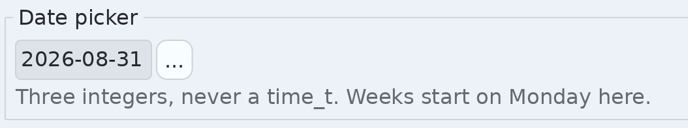

Formats are `SCHULTZ_DATE_ISO` (2026-09-02), `SCHULTZ_DATE_DMY` and
`SCHULTZ_DATE_MDY`. Month and day names are yours to supply, which is how the
picker is translated without the toolkit carrying a locale database.

**TimePicker** is a field that drops hour, minute and second number fields.
Those set their steps above and below, so the popup grows downward rather
than sideways and stays about as wide as the field it drops from.

```c
schultz_handle time = SCHULTZ_HANDLE_NONE;
int32_t hour, minute, second;

schultz_time_picker_create(tree, parent, &time);
schultz_time_picker_set_time(tree, time, 14, 30, 0);
schultz_time_picker_time(tree, time, &hour, &minute, &second);
schultz_time_picker_set_24_hour(tree, time, 1);
schultz_time_picker_set_show_seconds(tree, time, 1);
```

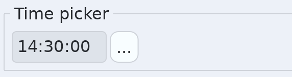

**ColorPicker** is a swatch that drops a picker. The square is strips rather
than a smooth gradient, so moving the hue does not register a new gradient
every frame.

```c
schultz_handle picker = SCHULTZ_HANDLE_NONE;

schultz_color_picker_create(tree, parent,
                            schultz_color_rgba(0xE0, 0x8A, 0x3C, 0xFF),
                            &picker);
schultz_color_picker_set_color(tree, picker,
                               schultz_color_rgba(0x29, 0x71, 0xAC, 0xFF));
schultz_color_picker_set_alpha_enabled(tree, picker, 1);
```

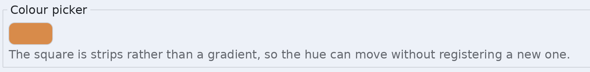

## Drawing

Two ways to draw. A **shape widget** is a node like any other, so it is styled
and laid out with everything else. A **canvas** is a surface you record
drawing into, and it is how you write a widget of your own.

### Shapes

Three shape widgets. None of them takes a colour: what a shape looks like
comes from its style, exactly as a panel's does.

```c
schultz_handle ellipse = SCHULTZ_HANDLE_NONE;
schultz_handle line = SCHULTZ_HANDLE_NONE;
schultz_handle polygon = SCHULTZ_HANDLE_NONE;
static const schultz_point points[3] = {
    { 10.0f, 40.0f }, { 40.0f, 0.0f }, { 70.0f, 40.0f }
};

/* Fills the node's bounds. Give it a size with the layout. */
schultz_ellipse_create(tree, parent, &ellipse);

/* Two points inside the node's bounds. */
schultz_line_create(tree, parent, schultz_point_make(0.0f, 0.0f),
                    schultz_point_make(60.0f, 40.0f), &line);
schultz_line_set_points(tree, line, schultz_point_make(0.0f, 40.0f),
                        schultz_point_make(60.0f, 0.0f));

/* A filled and stroked polygon. The points are copied. */
schultz_polygon_create(tree, parent, points, 3u, &polygon);
schultz_polygon_set_points(tree, polygon, points, 3u);
```

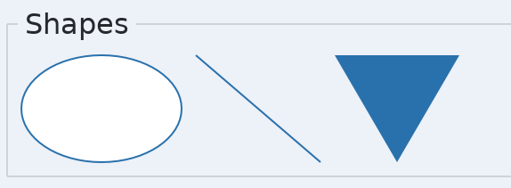

#### Every option a shape has

All of them are style properties, so they take a literal or a theme token, and
they can differ per state. See [Styling](styling.md).

| Property | What it does on a shape |
|---|---|
| `background` | What the inside is filled with: a colour or a gradient |
| `border.color` | What the outline is drawn with |
| `border.width` | How thick the outline is. Zero draws no outline |
| `border.dash` | A registered dash pattern, so the outline is dashed |
| `border.cap` | How a dash or an open line ends |
| `border.join` | How two segments of an outline meet |
| `border.dash.offset` | How far along the pattern the outline starts |
| `border.miter.limit` | How far a mitred corner may reach, as a multiple of the width |
| `corner.radius` | Rounded corners, on a rectangle |
| `opacity` | Fades the node and everything under it, as one picture |
| `shadow.color` | The shadow the subtree casts. Clear means none |
| `shadow.angle` | Which way it falls: degrees clockwise, 0 above, 180 below |
| `shadow.distance` | How far that way |
| `shadow.blur` | How soft the edge is |

```c
schultz_node_set_style_property(tree, node, SCHULTZ_PROP_BACKGROUND,
    schultz_value_token(SCHULTZ_TOKEN_COLOR_ACCENT));
schultz_node_set_style_property(tree, node, SCHULTZ_PROP_BORDER_WIDTH,
    schultz_value_number(2.0f));
schultz_node_set_style_property(tree, node, SCHULTZ_PROP_BORDER_CAP,
    schultz_value_number((float)SCHULTZ_CAP_ROUND));
```

| Constant | Values |
|---|---|
| Cap | `SCHULTZ_CAP_BUTT`, `SCHULTZ_CAP_ROUND`, `SCHULTZ_CAP_SQUARE` |
| Join | `SCHULTZ_JOIN_MITER`, `SCHULTZ_JOIN_ROUND`, `SCHULTZ_JOIN_BEVEL` |

A rectangle is not a separate widget. A `Panel` with a background, a border
and a corner radius already is one.

### Paints and strokes

Everything drawn takes either a **paint**, which fills, or a **stroke**, which
outlines. Both are small values you build on the spot.

```c
schultz_paint fill   = schultz_paint_solid(schultz_color_rgba(0x29, 0x71,
                                                              0xAC, 0xFF));
schultz_paint shiny  = schultz_paint_gradient(gradient_handle);

schultz_stroke pen   = schultz_stroke_solid(black, 2.0f);
schultz_stroke fancy = schultz_stroke_make(shiny, 2.0f);
```

A stroke is a struct, so the rest of it is set by hand:

```c
schultz_stroke pen = schultz_stroke_solid(black, 2.0f);

pen.dash        = dash_handle;   /* from schultz_dash_pair, or NONE */
pen.cap         = SCHULTZ_CAP_ROUND;
pen.join        = SCHULTZ_JOIN_ROUND;
pen.dash_offset = 4.0f;          /* how far along the pattern to start */
pen.miter_limit = 2.0f;          /* how far a mitred corner may reach */
```

Start from one of the two constructors rather than assigning every field. A
field added later then starts out sensible instead of holding whatever was on
the stack: `dash_offset` begins at zero and `miter_limit` at four, which is
where SVG and the rasterizer both start.

`dash_offset` says how far along the pattern a line begins, so drawing one
shape twice at two offsets interleaves the marks. It sits on the stroke rather
than on the registered pattern, which is why one pattern serves every offset.
`miter_limit` is a multiple of the stroke width: a sharp enough angle sends a
mitre running off towards infinity, and past the limit the corner is cut flat
instead.

Both are also style properties, `border.dash.offset` and
`border.miter.limit`, so a widget's own border reaches them without a stroke
being built by hand. Every setting a stroke has works both ways.

Gradients and dash patterns are registered once and used by handle, because
neither fits in a style value:

```c
static const schultz_gradient_stop stops[2] = {
    { 0.0f, { 0xF8, 0xFD, 0xFF, 0xFF } },
    { 1.0f, { 0x29, 0x71, 0xAC, 0xFF } }
};
static const float dashes[3] = { 6.0f, 3.0f, 1.0f };
schultz_handle sheen = SCHULTZ_HANDLE_NONE;
schultz_handle dotted = SCHULTZ_HANDLE_NONE;
schultz_handle dot_dash = SCHULTZ_HANDLE_NONE;

schultz_gradient_linear(resources, schultz_point_make(0.0f, 0.0f),
                        schultz_point_make(1.0f, 1.0f), stops, 2u, &sheen);
schultz_gradient_radial(resources, schultz_point_make(0.5f, 0.5f), 0.5f,
                        stops, 2u, &glow);
schultz_dash_pair(resources, 6.0f, 3.0f, &dotted);
schultz_dash_register(resources, dashes, 3u, &dot_dash);
```

A dash pattern is a run of lengths, on and off and on again. Nearly every one
is a mark and a gap, which is what `schultz_dash_pair` is for;
`schultz_dash_register` takes the array when the pattern is longer than that.

The resource table comes from the window with
`schultz_window_resources`. A gradient's geometry is in the 0 to 1 range of
whatever it is painting, so one gradient serves a button and a window alike.

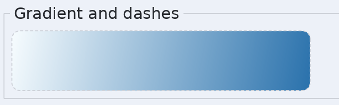

### Canvas

A canvas holds drawing you record. What you record between `begin` and `end`
is kept and replayed every frame, so appearance costs you nothing per frame.

**This is how you write a custom widget.** You do not implement the widget
interface from outside the toolkit. You record into a canvas and give the node
a token, so its events come back to you like any other widget's.

```c
schultz_handle canvas = SCHULTZ_HANDLE_NONE;

schultz_canvas_create(tree, parent, &canvas);

schultz_canvas_begin(tree, canvas);          /* clears what was there */
schultz_canvas_fill_rect(tree, canvas, schultz_rect_make(0, 0, 40, 20),
                         fill, 4.0f);
schultz_canvas_end(tree, canvas);
```

#### Drawing on exact pixels

By default a canvas draws in the same units as everything else, which on a
dense phone means one unit covers three of the screen's pixels. That is right
for a canvas used as a custom widget, where a line should match the borders
around it. It is wrong for a drawing that has to land on real pixels.

```c
schultz_canvas_set_pixel_exact(tree, canvas, 1);
schultz_canvas_pixel_size(tree, canvas, &width, &height);
```

Inside that canvas one unit is one pixel of the screen, so a line one wide is
one pixel. The canvas is still placed and sized like any other widget: one a
hundred units wide takes a hundred units of the layout, and its drawing space
is three hundred wide on a three times screen. `schultz_canvas_pixel_size`
reports that, so nothing has to be worked out by hand.

See "Pixels, and screens that have more of them" in `concepts.md`.

#### Every canvas function

Coordinates are the canvas's own, with its top left at zero.

| Function | Draws |
|---|---|
| `schultz_canvas_begin(tree, node)` | Starts recording, clearing whatever was there |
| `schultz_canvas_end(tree, node)` | Stops. Nothing shows until this is called |
| `schultz_canvas_fill_rect(tree, node, rect, paint, radius)` | A filled rectangle, rounded by `radius` |
| `schultz_canvas_stroke_rect(tree, node, rect, stroke, radius)` | A rectangle outline |
| `schultz_canvas_fill_ellipse(tree, node, rect, paint)` | A filled ellipse inscribed in the rectangle |
| `schultz_canvas_stroke_ellipse(tree, node, rect, stroke)` | An ellipse outline |
| `schultz_canvas_line(tree, node, from, to, stroke)` | A straight segment |
| `schultz_canvas_fill_polygon(tree, node, points, count, paint, rule)` | A filled polygon. The points are copied. `rule` is `SCHULTZ_FILL_NONZERO` or `SCHULTZ_FILL_EVEN_ODD`, which only differ where the outline crosses itself |
| `schultz_canvas_stroke_polygon(tree, node, points, count, stroke, closed)` | A polygon outline, or a polyline when not closed |
| `schultz_canvas_fill_path(tree, node, steps, step_count, points, point_count, paint, rule)` | A filled path, which may curve and may have holes |
| `schultz_canvas_stroke_path(tree, node, steps, step_count, points, point_count, stroke)` | A stroked path. A subpath that ends in a close is stroked all the way round |
| `schultz_canvas_text(tree, node, font, utf8, x, y, paint)` | A string. The position is the leading edge of the baseline. A gradient is measured across the run's own bounds; an emoji keeps its own colours |
| `schultz_canvas_image(tree, node, image, source, dest, opacity)` | A picture, scaling a region of it into a rectangle |
| `schultz_canvas_clip_begin(tree, node, rect)` | Narrows what the drawing after it may touch |
| `schultz_canvas_clip_end(tree, node)` | Restores the clip that was in force before the matching begin |
| `schultz_canvas_offset_begin(tree, node, dx, dy)` | Shifts everything drawn after it |
| `schultz_canvas_offset_end(tree, node)` | Restores the offset that was in force before the matching begin |
| `schultz_canvas_rotation_begin(tree, node, degrees, cx, cy)` | Turns everything drawn after it, clockwise, about a point |
| `schultz_canvas_rotation_end(tree, node)` | Restores the rotation that was in force before the matching begin |
| `schultz_canvas_group_begin(tree, node, opacity, shadow)` | Everything drawn after it becomes one picture, faded once and casting one shadow |
| `schultz_canvas_group_end(tree, node)` | Finishes that picture |
| `schultz_canvas_stroke_text(tree, node, font, utf8, x, y, stroke)` | A string drawn as outlines and stroked, rather than filled |
| `schultz_canvas_count(tree, node)` | How many commands are recorded |
| `schultz_canvas_measure_text(tree, font, utf8, &size)` | How wide a string will be. Draws nothing, and needs no open canvas |

The `source` rectangle on an image picks a region out, which is what a sprite
sheet wants. Clips, offsets, rotations and groups all nest: each applies on
top of the one before it, and each needs its matching end.

```c
schultz_canvas_offset_begin(tree, canvas, 20.0f, 0.0f);
schultz_canvas_clip_begin(tree, canvas, schultz_rect_make(0, 0, 64, 64));
schultz_canvas_image(tree, canvas, sprites,
                     schultz_rect_make(0, 0, 32, 32),     /* from the sheet */
                     schultz_rect_make(0, 0, 64, 64),     /* onto the canvas */
                     255u);
schultz_canvas_clip_end(tree, canvas);
schultz_canvas_offset_end(tree, canvas);
```

#### Several pieces that are one thing

A drawing made of several pieces is often one thing to the eye. A card is a
rounded rectangle, a title and a button glyph, and it should cast **one**
shadow and fade as **one** picture. A group is how you say so.

```c
schultz_paint bar = schultz_paint_solid(accent);
schultz_shadow under;

under.color    = schultz_color_rgba(0, 0, 0, 90);
under.angle    = 180.0f;                 /* 0 is up, so 180 is below */
under.distance = 4.0f;
under.blur     = 8.0f;

schultz_canvas_group_begin(tree, canvas, 1.0f, under);
schultz_canvas_fill_rect(tree, canvas, schultz_rect_make(0, 0, 160, 90),
                         bar, 8.0f);
schultz_canvas_text(tree, canvas, face, "Tuesday", 12.0f, 28.0f, bar);
schultz_canvas_group_end(tree, canvas);
```

Without the group those two would cast a shadow each, and the shadows would
overlap. With it there is one picture and one shadow in the shape of the
whole card.

The opacity works the same way, and the reason is the same. Fade the pieces
one at a time and everywhere they overlap is darker, because the same pixel
was blended twice. Fade the group and the picture is composed first and
blended once, so the overlap looks like the rest of it.

Groups nest, so a group may hold groups, each with its own fading and its own
shadow. `schultz_shadow_none()` is a group that only fades, and an opacity of
`1.0f` is a group that only casts a shadow.

A group left open when `schultz_canvas_end` is reached is closed there, so a
drawing that returned early still appears rather than being thrown away.

A full example, a small bar chart, which is what the demo draws:

```c
static const float values[7] = { 3, 7, 4, 9, 6, 8, 5 };
schultz_paint bar = schultz_paint_solid(accent);
schultz_stroke axis = schultz_stroke_solid(border, 1.0f);
uint32_t i;

schultz_canvas_begin(tree, canvas);
schultz_canvas_line(tree, canvas, schultz_point_make(0.0f, 100.0f),
                    schultz_point_make(140.0f, 100.0f), axis);
for (i = 0; i < 7u; i++) {
    float height = values[i] * 10.0f;

    schultz_canvas_fill_rect(tree, canvas,
        schultz_rect_make((float)i * 20.0f, 100.0f - height, 16.0f, height),
        bar, 2.0f);
}
schultz_canvas_text(tree, canvas, font, "seven readings", 0.0f, 116.0f,
                    schultz_paint_solid(text_color));
schultz_canvas_end(tree, canvas);
```

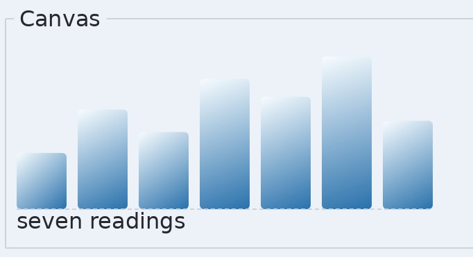

#### Paths

A polygon is a list of corners. A path is the general thing: it can curve, it
can lift the pen and start again, and it is what arcs and rounded outlines are
made of.

A path is two arrays read together. The first says what to do; the second
holds the points those steps use. Each step takes a fixed number of points off
the front of the second array, so the two counts differ and both are given:

| Step | Points it takes |
|---|---|
| `SCHULTZ_PATH_MOVE` | 1, where a new subpath starts |
| `SCHULTZ_PATH_LINE` | 1, where the line ends |
| `SCHULTZ_PATH_CURVE` | 3: two controls, then where the curve ends |
| `SCHULTZ_PATH_QUAD` | 2: one control, then where the curve ends |
| `SCHULTZ_PATH_CLOSE` | none |

A path begins with a move. A second move starts a second subpath, which is how
a shape gets a hole in it. A quadratic is raised to the cubic that draws the
same curve when it is recorded, exactly and with no loss, so a `QUAD` never
reaches the rasterizer.

The two counts have to agree exactly: the points the steps ask for between
them is the number of points you pass, and a path with any left over is
refused rather than drawn with the wrong ones.
`schultz_path_step_points(step)` says how many one step takes, which is what
to add up when a path is built in a loop.

```c
uint8_t steps[4];
schultz_point points[5];
schultz_paint paint = schultz_paint_solid(accent);

steps[0] = SCHULTZ_PATH_MOVE;
steps[1] = SCHULTZ_PATH_LINE;
steps[2] = SCHULTZ_PATH_CURVE;
steps[3] = SCHULTZ_PATH_CLOSE;

points[0] = schultz_point_make(10.0f, 10.0f);  /* move here */
points[1] = schultz_point_make(90.0f, 10.0f);  /* line to here */
points[2] = schultz_point_make(90.0f, 50.0f);  /* first control */
points[3] = schultz_point_make(50.0f, 90.0f);  /* second control */
points[4] = schultz_point_make(10.0f, 90.0f);  /* the curve ends here */

schultz_canvas_fill_path(tree, canvas, steps, 4u, points, 5u, paint,
                         SCHULTZ_FILL_NONZERO);
```

#### Turning what you draw

`schultz_canvas_rotation_begin` turns everything drawn after it. The angle is
in **degrees**, clockwise, because y grows downward, and the centre is a point
in the canvas's own coordinates, so turning something about its own middle is
one call:

```c
schultz_canvas_rotation_begin(tree, canvas, -90.0f, 16.0f, 88.0f);
schultz_canvas_text(tree, canvas, font, "up the side", 16.0f, 88.0f, fill);
schultz_canvas_rotation_end(tree, canvas);
```

Rotations nest with each other and with offsets, and an offset pushed inside
a rotation moves along the turned axes, so the two compose the way you would
expect.

**This turns the drawing, not the canvas.** The node keeps its upright bounds,
takes the same space in the layout, clips to the same rectangle and is hit
tested the same. Nothing turned can escape the canvas. That is what makes the
feature cheap: no other part of the toolkit has to learn about angles.

Three things to know:

- **Text at an angle is drawn from the font's outlines**, not from the cached
  upright picture of each letter, so it stays sharp rather than being a
  resampled photograph of itself. It gives up hinting, which is what happens
  to rotated text in every toolkit and is why no toolkit rotates body text.
- **An emoji has no outline** to draw from, so it is turned as the picture it
  is. That is the right answer for a picture and the wrong one for a letter,
  which is why the two take different routes.
- **A clip pushed inside a rotation** is the upright box around the turned
  rectangle rather than the turned rectangle itself, so it lets through a
  little more than it names. The canvas's own clip is outside any rotation and
  is exact.

Once outlines are available, text can also be stroked rather than filled:

```c
schultz_stroke ring = schultz_stroke_solid(black, 1.0f);

schultz_canvas_stroke_text(tree, canvas, font, "outlined", 20.0f, 112.0f,
                           ring);
```

That costs more than `schultz_canvas_text`, which draws from pictures the
toolkit keeps, so it is for the few words that want it rather than for prose.

#### Arcs, pies and chords

Nothing underneath has an arc of its own, so `schultz_arc_path` builds one out
of cubic curves split at the quarter turn and hands back a path. The three
shapes are one curve finished three ways: left open, closed through the centre
as a pie, or closed straight across as a chord.

Angles are in **degrees**, from three o'clock, running clockwise. The two
arrays are yours and are small enough to live on the stack.

```c
uint8_t arc_steps[SCHULTZ_ARC_STEPS_MAX];
schultz_point arc_points[SCHULTZ_ARC_POINTS_MAX];
schultz_paint paint = schultz_paint_solid(accent);
uint32_t step_count = 0u;
uint32_t point_count = 0u;

schultz_arc_path(schultz_rect_make(0.0f, 0.0f, 60.0f, 60.0f),
                 200.0f, 250.0f, SCHULTZ_ARC_PIE,
                 arc_steps, &step_count, arc_points, &point_count);
schultz_canvas_fill_path(tree, canvas, arc_steps, step_count, arc_points,
                         point_count, paint, SCHULTZ_FILL_NONZERO);
```

The rectangle is the one the whole ellipse fits in, not just the part the arc
covers. The three endings are `SCHULTZ_ARC_OPEN`, `SCHULTZ_ARC_PIE` and
`SCHULTZ_ARC_CHORD`: open leaves the curve as a line that bends, a pie closes
by way of the centre, and a chord closes straight across between the two ends.
Open is the one to stroke, since it has no closing step.

A sweep of 360 degrees or more is clamped to a whole turn, and a sweep of zero
draws nothing rather than leaving a stray move behind.

**A rounded rectangle** is `fill_rect` or `stroke_rect` with a radius, rather
than a call of its own. A radius of zero gives square corners.

#### What a canvas cannot do yet

Measured against the two canvases most people arrive from, the HTML canvas and
JavaFX's `GraphicsContext`, this is what is still missing.

| Missing | Both references have | What to do today |
|---|---|---|
| Scale and skew | `scale`, `transform` | Work the coordinates out yourself. Rotation is there; the rest of the matrix is not |
| An arc through control points | `arcTo` | Give `schultz_arc_path` a box and two angles instead |
| Clearing a region | `clearRect` | Fill it with the background colour |
| A whole canvas opacity | `globalAlpha` | Put the alpha in each colour |
| Blend modes | `globalCompositeOperation` | Nothing |
| A tiled image as a fill | `createPattern` | Draw the image repeatedly with `schultz_canvas_image` |
| A gradient that sweeps round | `createConicGradient` | Nothing. Linear and radial are the two the rasterizer has |
| Reading pixels back | `getImageData` | Render the tree to a buffer with `schultz_render_to_buffer` |

**Rotation is the only part of the matrix the list carries.** A draw list holds
a translation and a rotation, applied in that order, and nothing else. Scale is
already spoken for by `schultz_canvas_set_pixel_exact`, which changes what a
unit means rather than stretching what is drawn, and skew has never been asked
for. Adding either would be a change to the painting contract rather than an
addition to the canvas, though the matrix that carries the rotation would take
them without being reshaped.

**A whole canvas opacity is the one on this list you already have.** Set
`opacity` on the canvas node and everything it draws fades together, because
the paint walk composes the subtree into one picture before fading it. See
[Opacity fades a whole subtree](styling.md#opacity-fades-a-whole-subtree).

### Images

**Icon** draws a loaded image. PNG, JPEG, WebP and SVG all arrive through the
same call.

```c
schultz_handle image = SCHULTZ_HANDLE_NONE;
schultz_handle icon = SCHULTZ_HANDLE_NONE;

schultz_image_load_file(images, "assets/images/checker.png", &image);
schultz_icon_create(tree, parent, image, &icon);
schultz_icon_set_fit(tree, icon, SCHULTZ_FIT_CONTAIN);
schultz_icon_set_image(tree, icon, another);
schultz_handle showing = schultz_icon_image(tree, icon);
```

| Fit | What it does |
|---|---|
| `SCHULTZ_FIT_CONTAIN` | As large as fits, keeping the aspect ratio |
| `SCHULTZ_FIT_COVER` | Fills the bounds, keeping the ratio, clipping the rest |
| `SCHULTZ_FIT_FILL` | Stretches to the bounds, ignoring the ratio |
| `SCHULTZ_FIT_NONE` | Its natural size, whatever the bounds are |

`opacity` fades a picture like anything else, and it is set on the node
rather than passed to the image, so a picture inside a faded card fades with
the card.

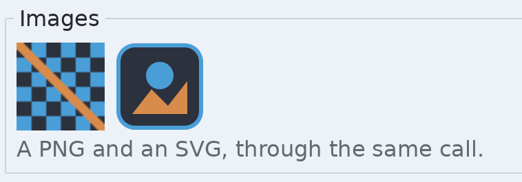

### Pictures that did not come from a file

Everything above starts with `schultz_image_load_file`, which is the ordinary
case. The table behind it takes pictures three other ways, and hands them
back as bytes again.

**From memory**, which is what a picture that arrived over a network or out of
an archive needs. The kind is a hint, and NULL means work it out from the
bytes:

```c
schultz_image_load_data(images, bytes, (uint32_t)length, NULL, &image);
```

**From pixels you already have**, premultiplied ARGB8888, the same layout
everything else in the toolkit uses. A stride of zero means the rows are
packed:

```c
schultz_image_set_pixels(images, pixels, width, height, 0u, &image);
```

**As a file, in memory**, which is the other direction. PNG or BMP:

```c
schultz_image_encode(pixels, width, height, 0u, SCHULTZ_IMAGE_PNG,
                     &png_bytes, &png_length);
```

The bytes belong to the toolkit and stay valid until the next call to it, so
a caller wanting two formats at once copies the first.

And the housekeeping around all of them:

```c
schultz_size size;
float frames = 0.0f;
float seconds = 0.0f;

schultz_image_size(images, image, &size);
schultz_image_frames(images, image, &frames, &seconds);
schultz_image_set_frame(images, image, 2.0f);
schultz_image_unload(images, image);
uint32_t held = schultz_image_count(images);
```

`schultz_image_frames` reports more than one frame for an animation loaded
with `schultz_image_load_animation`, along with how long it runs;
`schultz_image_set_frame` picks which frame draws. Frames are floats because
an animation is seeked to a position rather than stepped by whole pictures.

### A picture of a widget

The other direction again: any node, and everything under it, rendered into
pixels. A screenshot, a thumbnail, something to print, something to put on the
clipboard.

One call, when what you want is the file:

```c
schultz_render_encode(tree, node, 1.0f, &render_options, SCHULTZ_IMAGE_PNG,
                      &png_bytes, &png_length);
```

The scale is pixels per unit, so two gives a picture twice the size, and text
is rasterized at that scale rather than scaled up from screen size, which is
what makes a page at print resolution sharp. How large it may get is decided
by that number, so it is checked before anything is drawn rather than after.

When the pixels themselves are the point -- to hand back as an image, to
upload, to write more than one format from one render -- ask how large a
buffer is needed and render into your own:

```c
schultz_render_size(tree, node, 1.0f, &width, &height);
/* allocate width * height * 4 bytes, then: */
schultz_render_to_buffer(tree, node, 1.0f, &render_options, pixels,
                         width, height, 0u);
```

The node is drawn at the buffer's top left whatever its position in the tree,
so rendering one widget gives that widget and nothing around it. The options
carry the fonts, glyphs, images and gradients a draw needs, and a background:
a transparent one leaves the buffer transparent where nothing was drawn, which
is what an icon export wants, and an opaque one is what a screenshot wants.

**Lottie** plays a Lottie animation, advanced on the tree's clock.

```c
schultz_handle anim = SCHULTZ_HANDLE_NONE;

schultz_image_load_file(images, "assets/spinner.json", &image);
schultz_lottie_create(tree, parent, image, &anim);
schultz_lottie_set_looping(tree, anim, 1);
schultz_lottie_play(tree, anim, 1);
schultz_lottie_seek(tree, anim, 0.0f);

float frame = schultz_lottie_frame(tree, anim);
int32_t running = schultz_lottie_is_playing(tree, anim);
```

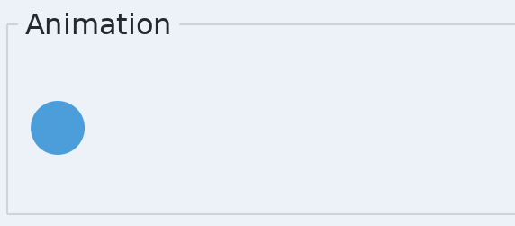

Anything can be moved by changing its bounds each frame.

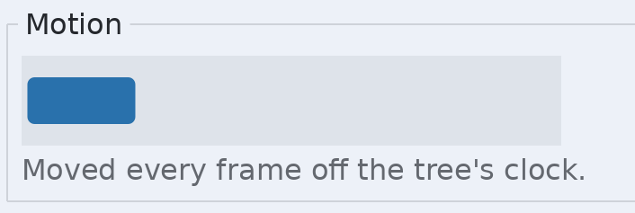

### Video

**Video** plays a film. WebM carrying VP8 or VP9 for the picture and Opus for
the sound, which are the formats that can be shipped without a patent licence.

There are two ways to give it something to play.

```c
schultz_handle film = SCHULTZ_HANDLE_NONE;

schultz_video_create(tree, parent, 1u, &film);   /* 1 decode thread */
schultz_video_open_file(tree, film, "assets/clip.webm");
schultz_video_play(tree, film);
```

`schultz_video_open_file` names a file and Schultz reads it. Nothing is held
in memory but the part being decoded, so a long film costs a buffer rather
than its whole size.

```c
schultz_handle film = SCHULTZ_HANDLE_NONE;
const void *bytes = NULL;
uint64_t length = 0u;

schultz_video_write(tree, film, bytes, length);  /* as they arrive */
uint64_t waiting = schultz_video_queued(tree, film);
```

`schultz_video_write` is the streaming way in: the host owns the socket and
hands over bytes, and the node cannot tell a file from a socket. `_queued`
says how much has been written and not yet read, which is how a host decides
when to write more.

**The thread count** is the third argument to `_create`. Zero decodes on
whichever thread advances the tree, which is enough for a small picture: a
frame of 480p costs a few milliseconds and a frame budget is sixteen. One or
more decodes ahead on threads of its own, which is what anything the size of
1080p needs. The first of them reads the file and drives the decoder; any
beyond it are given to the decoder to split a picture between.

A decode thread only ever produces pictures. It does not touch the tree, the
draw list or any handle, so nothing else in the toolkit becomes concurrent.

**Sound** comes with the picture when the file carries an Opus track and the
tree has been given a sound system:

```c
schultz_handle film = SCHULTZ_HANDLE_NONE;

schultz_tree_set_audio(tree, audio);             /* once, at startup */

int32_t loud = schultz_video_has_sound(tree, film);
schultz_video_set_volume(tree, film, 0.6f);
schultz_video_set_muted(tree, film, 1);
```

The sound is also the clock. A picture carries the time it should be shown at,
and the widget compares that against where the sound has actually got to, so a
decode that falls behind drops pictures rather than drifting out of step. A
film with no sound runs on the tree's clock instead.

**Moving about in it.** A file can be seeked in, because Schultz still has it.
A stream cannot, because the bytes are gone once they have been handed over.

```c
schultz_handle film = SCHULTZ_HANDLE_NONE;

int32_t movable = schultz_video_can_seek(tree, film);
schultz_video_seek(tree, film, 5000u);           /* five seconds in */

uint64_t at    = schultz_video_position(tree, film);
uint64_t total = schultz_video_duration(tree, film);
```

A seek moves to the keyframe **at or before** the point asked for, because
that is the last place a decoder can start. How far back that is depends on
how the film was encoded -- a second is common, several seconds happens. So
`schultz_video_position` afterwards is at or before what you asked for, and it
is the number to show somebody rather than the one you passed.

`schultz_video_pause` holds the picture where it is. `schultz_video_stop`
winds back, so the next play starts from the top.

**Controls** are a set of flags. A node shows none until it is asked.

```c
schultz_handle film = SCHULTZ_HANDLE_NONE;

schultz_video_set_controls(tree, film, SCHULTZ_VIDEO_CONTROLS_ALL);
```

| Flag | What appears |
|---|---|
| `SCHULTZ_VIDEO_CONTROL_PLAY` | One button that plays, and pauses once playing |
| `SCHULTZ_VIDEO_CONTROL_STOP` | Stop, which returns to the beginning |
| `SCHULTZ_VIDEO_CONTROL_POSITION` | How far through, draggable when the film can be seeked in |
| `SCHULTZ_VIDEO_CONTROL_TIME` | Elapsed and total, as text |
| `SCHULTZ_VIDEO_CONTROL_MUTE` | A button that silences the sound and gives it back |
| `SCHULTZ_VIDEO_CONTROL_VOLUME` | How loud, as a slider |

`SCHULTZ_VIDEO_CONTROLS_NONE` is zero and is the default, which is the silent
looping clip on a landing screen. `SCHULTZ_VIDEO_CONTROLS_ALL` is every flag,
which is a player. Anything between is a set of flags, so a host that wants
play and mute and nothing else says so.

The controls are ordinary child nodes in a row across the bottom of the
picture, built from the button, slider and label that already exist. They are
not painted by hand and they are not a second styling system: a theme that
restyles buttons restyles these, and the accessibility layer reads them out
like any other control.

The picture fits inside the node and is centred, keeping its proportions, so a
node the wrong shape gets bars rather than a stretched picture. A node at rest
shows the film's first picture rather than a hole, and then stops asking to be
ticked, so a film nobody is playing costs nothing.

**One rule about shutting down.** A node playing sound holds a stream that
belongs to the sound system, and gives it back when the node is destroyed. So
tear down in this order: the video nodes, then the sound system, then the
window. The window is last because destroying it ends SDL, and the sound
system cannot be taken down after that. The demo's `cleanup` does exactly
this.

### Sending video somewhere

The other direction from playing a film. An encoder takes pictures and
produces VP8 packets; a decoder turns them back into pictures. Neither is a
widget and neither touches a file or a socket.

```c
schultz_video_encoder *encoder = NULL;
const uint32_t *argb = NULL;
const void *bytes;
uint64_t length, when_ns = 0u;
int32_t keyframe;

schultz_video_encoder_create(SCHULTZ_VIDEO_CODEC_VP9, 640u, 480u, 30u,
                             600000u, &encoder);
schultz_video_encoder_write_frame(encoder, argb, 640u, 480u, when_ns);

while (schultz_video_encoder_read_packet(encoder, &bytes, &length, &when_ns,
                                         &keyframe) == SCHULTZ_OK) {
    /* send it, write it, keep it */
}
```

The pictures go in as premultiplied ARGB, which is the same shape
`schultz_camera_frame` hands back, so a camera wires to an encoder with
nothing in between. Times must go forward: a picture whose time is not later
than the one before it is refused rather than quietly reordered.

Two inputs make a transport possible on top of this, and without them
congestion control and loss recovery cannot be built at all:

- `schultz_video_encoder_set_bitrate` turns the target up or down from the
  next picture onward.
- `schultz_video_encoder_force_keyframe` makes the next picture one. A
  receiver that lost packets shows nothing until a keyframe reaches it.

A third is optional, and trades processor for picture:

```c
schultz_video_encoder *encoder = NULL;

schultz_video_encoder_set_speed(encoder, 4u);   /* default 8 */
```

Zero is the slowest and best, `SCHULTZ_VIDEO_SPEED_MOST` the quickest and
roughest. It matters far more to VP9 than to VP8: measured on a build with no
SIMD at 320x240, VP8 takes about six milliseconds a picture whatever it is
asked for, while VP9 ranges from 58 milliseconds at zero to under four at
eight and above. If you have processor to spare, VP9 is where there is
something to buy with it.

Either codec: `SCHULTZ_VIDEO_CODEC_VP9` or `_VP8`. VP9 is the default of the
two and, measured on a pure C build at the fast setting used here, encodes
*faster* than VP8 as well as compressing better -- the usual "VP9 costs more
processor" only holds at the slow settings a file encoder would use.

The decoder is the other half, and takes bare packets in the order they were
produced. The codec has to be said, because a bare packet does not carry it --
a container would, which is why the video node never has to be told:

```c
schultz_video_decoder *decoder = NULL;
const uint32_t *pixels;
uint32_t width, height;
const void *bytes = NULL;
uint64_t length = 0u;

schultz_video_decoder_create(SCHULTZ_VIDEO_CODEC_VP9, &decoder);
schultz_video_decoder_write_packet(decoder, bytes, length);
while (schultz_video_decoder_read_frame(decoder, &pixels, &width, &height)
           == SCHULTZ_OK) {
    /* width * height words of premultiplied ARGB */
}
```

This is not how a film is played -- a film arrives as WebM and is played by a
video node, which knows about tracks, timing and sound. This is what a
receiver on the far end of a transport has and nothing more. The demo's Round
trip card runs a camera through both and draws each end side by side.

### Saving a film to a file

An encoder produces bare packets. Bare packets are what a transport wants and
nothing a media player will open: a file has to say which codecs are inside,
how big the picture is, when each packet belongs, and where to jump to when
somebody drags a slider. That wrapper is called a container, and the one this
toolkit reads and writes is WebM.

`schultz_video_writer` is the other end of `schultz_video_open_file`. That one
reads a film; this one makes one.

```c
schultz_video_writer *writer = NULL;
const void *bytes = NULL;
uint64_t length = 0u, when_ns = 0u;
int32_t keyframe = 0;

schultz_video_writer_create("clip.webm", SCHULTZ_VIDEO_CODEC_VP9, 640u, 480u,
                            &writer);
schultz_video_writer_add_sound(writer, 1u);          /* optional */

/* for each packet an encoder hands back */
schultz_video_writer_write_picture(writer, bytes, length, when_ns, keyframe);

schultz_video_writer_close(writer);
```

Four rules, and they are all the ones there are.

**The codec has to match.** The file names the codec in its header, and a
player believes it. A file that says VP9 over VP8 packets plays as nothing.
Pass the writer the same codec the encoder was created with.

**The sound track goes on before the first packet.** Tracks are listed at the
top of the file, and the top of the file is written the moment something
arrives. After that the list is out and nothing can be added to it, so
`schultz_video_writer_add_sound` answers `SCHULTZ_ERR_UNAVAILABLE`. Opus, at
forty eight thousand samples a second, which is what
`schultz_audio_encoder_create` produces.

**The keyframe flag is not decoration.** The writer starts a new section of
the file at every keyframe and records where it landed. That record is the
index a player uses when somebody drags a slider. Pass the flag straight
through from `schultz_video_encoder_read_packet`; a file written with every
packet marked ordinary plays from the start and cannot be moved about in.

**Close it.** Two things can only be known at the end: how long the film is,
and the index. Both are written by `schultz_video_writer_close`, which patches
them into space reserved on the way past. A writer that is dropped without it
leaves a file that plays but does not know its own length and cannot be
seeked in.

Each track keeps its own clock, so times have to go forward within a track but
not between them. This matters in practice: an encoder hands back pictures
well ahead of the sound that belongs with them, so the times arriving at the
writer jump back and forth all day. Within one track, a packet earlier than
the one before it is refused rather than quietly reordered.

One thing to watch when feeding both. An Opus packet is twenty milliseconds
and a picture at thirty a second is thirty three, so it is not one sound
packet per picture. Write sound until it has caught up with where the picture
is, or the sound track ends well before the picture does and seeking reads
oddly:

```c
schultz_video_writer *writer = NULL;
schultz_audio *audio = NULL;
schultz_handle voice = SCHULTZ_HANDLE_NONE;
const float *samples = NULL;
const void *bytes = NULL;
uint64_t length = 0u, when_ns = 0u, picture_ms = 0u, sound_ms = 0u;

while (sound_ms <= picture_ms) {
    schultz_audio_encoder_write(audio, voice, samples, 960u);
    while (schultz_audio_encoder_read_packet(audio, voice, &bytes, &length,
                                             &when_ns) == SCHULTZ_OK) {
        schultz_video_writer_write_sound(writer, bytes, length, when_ns);
    }
    sound_ms += 20u;
}
```

What comes out is an ordinary WebM file. It opens in a browser, in ffmpeg and
in `schultz_video_open_file`, and it seeks.

### Camera

**Camera preview** shows what a camera sees. The camera itself is not a
widget: it is hardware, and it is opened and closed by the host.

```c
schultz_camera *camera = NULL;
schultz_handle preview = SCHULTZ_HANDLE_NONE;

if (schultz_camera_count() > 0u) {
    schultz_camera_open(schultz_camera_device(0u), 640u, 480u, &camera);
}
schultz_camera_preview_create(tree, parent, camera, &preview);
```

Three things are worth knowing.

**A camera may not be there.** `schultz_camera_count` returning zero is an
ordinary answer, not a failure, and every other call answers sensibly on a
machine with none. Say so and carry on.

**Opening one is not the same as being allowed to use it.** The operating
system asks the person, and the answer can take seconds or minutes. Opening
succeeds or fails immediately on whether the device exists; permission is a
separate question:

```c
schultz_camera *camera = NULL;

switch (schultz_camera_permission(camera)) {
case SCHULTZ_CAMERA_WAITING:  /* ask again next frame */  break;
case SCHULTZ_CAMERA_ALLOWED:  /* pictures are arriving */ break;
case SCHULTZ_CAMERA_REFUSED:  /* they never will */       break;
}
```

The preview node does that waiting for you and draws nothing until the answer
is yes. A node with no camera asks for no clock at all, so a preview showing
nothing costs nothing.

**The pictures come back ready to draw.** A webcam's own format is usually
Motion JPEG or a packed YUV layout; that is decoded and converted below this
interface, so a frame is always premultiplied ARGB at the size asked for.

A host that wants the pixels rather than a node on screen takes them directly:

```c
schultz_camera *camera = NULL;
const uint32_t *pixels;
uint32_t width, height;
uint64_t when_ns;

schultz_camera_open(schultz_camera_device(0u), 640u, 480u, &camera);
if (schultz_camera_frame(camera, &pixels, &width, &height, &when_ns)
        == SCHULTZ_OK) {
    /* width * height words, no padding between rows */
}
```

`SCHULTZ_ERR_EXHAUSTED` means no new picture since the last call, which is the
usual answer: a camera at thirty a second has nothing new on most turns of a
loop running at sixty. The pixels stay valid until the next call for the same
camera, so a host that needs to keep one copies it.

Close the camera before the window, because closing it is an SDL call and
destroying the window ends SDL.

## What is not here

Schultz does not ship a table or a data grid. It does not ship drag and drop.
Rich text inside one block, where a phrase can be bold or a link can sit in the
middle of a sentence, is not built either: a text block is one font in one
colour.
